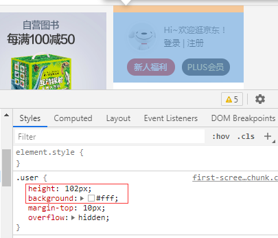
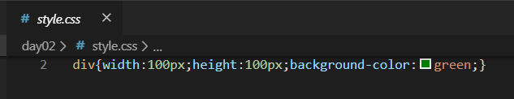
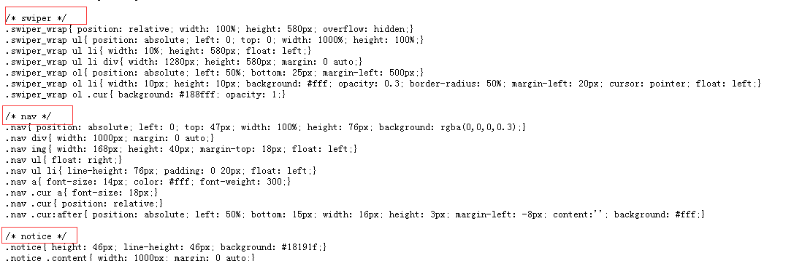
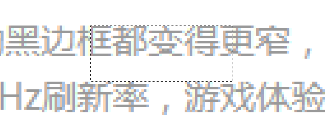

- 

# 初识CSS

## 学习目标

- 能够说出什么是CSS
- 熟悉CSS的语法规范
- 掌握CSS的三种引入方式，能够使用3种引入方式写一个红色的小方块

## 什么是CSS?

### 全称

Cascading Style Sheets
通常称为CSS样式表或层叠样式表（级联样式表）

### 作用

- 为HTML标记语言提供了一种样式描述
- 即【设置HTML页面中的元素的位置、排版、样式外观等】
  如文本内容（字体、大小、对齐方式等）、图片的外形（宽、高、边框等）


## CSS语法规范



CSS 规则由两个主要的部分构成：选择器、一条或多条声明

选择器:通常是需要改变样式的 HTML 标签。 

声明组：以大括号{}括起来

每条声明由一个属性和一个值组成,
属性与属性值之间以【冒号】分隔
多个声明，用【分号】将每个声明分开

## CSS引入方法

当读到一个样式表时，浏览器会根据它来格式化 HTML 文档，插入样式表的方法有三种:行间样式表，内部样式表，外部样式

### 行间样式

概述：	

- 通过HTML元素的style属性设置样式称为行间样式

- 代码示例

  ```
  <div style="width:100px;height:100px;background-color:red;">div</div>
  ```

- 注：任何HTML元素都可以设置行间样式

### 内部样式

- 概述：	

  在HTMLhead标签的内部，由style标签包含的样式称为内部样式

- 代码示例

  ```
  <head>
  	<style>css样式
  </style>
  ```

### 外部样式

- 概述

  - 外部样式表是指将CSS编写在扩展名为.css 的单独文件中,使用link标签引用

    - 新建外部样式表

    

    - 头部标签内部使用link标签引用

    ```
    <head>
    	<link rel="stylesheet" href="style.css">
    </head>
    ```

    - #### 说明

      - href="" 资源链接的地址
      - rel表示引入文 件与当前文 档的关系
      - stylesheet为样式表

#### 总结：

- 行间样式适用于某个元素拥有特殊样式时使用，结构 表现【不分离】
- 内部样式适用于单个页面拥有特殊样式时使用，结构表现【半分离】
- 外部样式适用于多个页面拥有相同样式时使用，结构表现【相分离】

### css注释 

#### 什么是注释 ：

注释即对代码的解释和说明
不会被浏览器解析执行



#### 注释的语法：

```
CSS中的注释以"注释以/*开头，以*/结尾,开始和结束中间为注释内容
```

#### 注释的作用：

解释说明,标记不同代码节的开始
代码调试,用于在测试中临时禁用一段代码

#### 生成快捷方式：

 ctrl + /

# CSS选择器

## 学习目标

- 掌握常用选择器的使用
- 熟悉选择器的优先级关系
- 掌握调试工具的基本使用

## 什么是选择器

- CSS选择器是CSS规则的第一部分，每个CSS规则都以一个选择器或一组选择器为开始，
- CSS 选择器即用于“查找”（或选取）要设置样式的 HTML 元素的模式
- 选择器可以分为基础选择器、复合选择器

## 基本选择器

### 通配（通用）选择器

- 语法 *{ 样式声明 }
- 作用：匹配任意类型的HTML元素

```html
<style>        
    /* 页面上所有元素都被选择 */
    *{
        background-color:green;
    }
        
</style>
<body>
    <p>p</p>
    <div>div1</div>
    <div>div2
        <div>div3</div>
    </div>
    
</body>
```

### 元素名称选择器

- 语法： 元素名称{ 样式声明 }
- 作用：选择所有同一元素名称的所有元素

```
/* 选择body */
body{
	background-color:green;
}
/* 选择页面上所有的div */
div{
	width:100px;
	height:100px;
	background-color:red;
}
/* 选择页面上所有的p */
p{
	background-color: pink;
}
```

### 类选择器

- 语法 

  - HTML中通过class属性定义
    如：<div class="box"></div>
  - css中以点进行标识:.
    .类名{ 样式声明 }
- 作用:选择所有带有指定类名的元素
- 多类名的使用

  - 语法：空格隔开

```html
<style>

.box{
	background-color:red;
}

.size{
    width:100px;
    height:100px;

}

</style>
<body>
    <p class="box size">p</p>

    <div class="box">div1</div>
    <div>div2
    <div class="box">div3</div>
    </div>
</body>
```

### id选择器

- 语法 

  - HTML中通过id属性定义
    如：<div class="box"></div>
    
  - css中以点进行标识:#
    
    > #id名称{ 样式声明 }
- 作用:选择所有带有指定类名的元素

```
#box{
	background-color:red;
}
<div id="box">div1</div>
```

注意：具有唯一性，一般用于页面唯一性的元素如头部、底部等，经常和 JavaScript 搭配使用

### 类与id的命名规则

- 见词知义，尽量用英文；
- 始终建议以字母开头，可以包含数字、字母、下划线等
- 不要以数字开头
- 多个单词可以以驼峰式（newsCont）、中划线连接（news_cont）、下划线连接（news-cont）等

### 总结

- 总结使用频率
  - 基础选择器中最常用是类选择器
  - id用于页面中唯一模块
  - 元素名称选择器定义的全局样式，单独使用要慎重
  - *号通常用于重置样式【最不常用】

- 总结id与类的区别总结

- 基础选择器的优先级

  - 对比

  - 渗透调试工具的使用

    ```
    - F12/右键-检查
    - 左边是 HTML 元素结构，右边是 CSS 样式
    - Ctrl+滚轮 可以放大、缩小开发者工具代码大小
    - Ctrl + 0 复原浏览器大小
    - 右边 CSS 样式可以改动数值（左右箭头或者直接输入）和查看颜色
    - 如果点击元素，发现右侧没有样式引入，极有可能是类名或者样式引入错误
    - 如果有样式，但是样式前面有黄色叹号提示，则是样式属性书写错误
    - 如果有样式，但是样式被中划线贯穿，说明可能存在书写顺序 或优先级问题
    ```

  - 结论

    ```
    最终排序：id（身份证号是XX的学生）> 类（名叫王小帅的学生） >元素名称（所有男生） > *(所有学生)
    选择范围越精确，优先级越高
    ```

```
字体文本属性大多具有继承性

可继承的属性
    font-size
    font-family
    font-style
    font-weight
    font
    line-height
    text-align
    text-indent
    color

不可继承
    text-decoration 
    穿透性
```


# CSS 表格

## 学习目标

- 掌握表格常用css属性
- 能够实现1像素表格细线边框

- 概述：使用 CSS 可以大大提高 效率，更灵活的控制HTML 表格的外观表现

## 表格边框

指定 CSS 表格边框，使用 border 属性，通常定义td,th的边框属性

表格会呈现双边框，是因为表和 th / td 元素有独立的边界。

table存在默认属性border-collapse：separate

## 表格的折叠边框

border-collapse表示折叠边框

- 取值
  - separate：边框独立（默认值）
  - collapse：相邻边被合并

## 单元格内容的垂直对齐 

- vertical-align 作用：垂直对齐属性设置垂直对齐，比如顶部，底部或中间

- 常用值

  - top顶部对齐
  - middle居中对齐
  - bottom底部对齐

### 小节：如何使用css实现表格的1像素边框

```
table{
	border-collapse:collapse;
}
th{
	/*简单代过*/
	border:1px solid red;
}
td{
	border:1px solid red;
}
```

# CSS字体 ,文本属性

### 学习目标

- 熟练掌握css常用文本属性
- 熟练掌握css常用字体属性
- 能够说出颜色的常用表示方法

### font-family：

- 作用：设置文本的字体系列

- 语法：font-family:字体名称

- 常用值：

  - 一个字体名称或系列名称（介绍常用字体名称、字体系列）

    - 微软雅黑   Microsoft YaHei
    - 宋体       simsun
    - 黑体     HeiTi
    - 楷体     KaiTi

  - 多个字体名称

    - 逗号分开
      如果浏览器不支持第一个字体，则会尝试下一个（回退机制）

      ```
      .box{
         /*font-family:"微软雅黑","宋体";*/
          /*font-family:"宋体","微软雅黑"; *//*与上一个相比产生的效果不同，谁在前使用哪一个*/
          font-family:"微软雅黑abc","宋体";  /*第一个任意改写一个系统不存在的字体，会按照第二个字体显示*/
      }
      ```

- 注意如果字体名称包含空格、汉字、特殊字符，必须加引号。

  ```
  .box{font-family: "Microsoft YaHei";}
  ```

  

### font-size

- 作用：设置字体的大小
- 语法：font-size:值
- 常用值：

  - 长度值（通常是像素px）
  - 百分比（相对于父元素计算）
- em
  - 相对单位
  - 如果用于字号，相当于父元素字号计算，如果用于其它属性，相对于当前元素的字号
- 大多数浏览器的默认值字号：16px


### font-style

- 作用：设置字体的大小

- 语法：font-style:值

- 常用值：

  - normal默认值
  - italic斜体显示


### font-weight

- 作用：设置字体粗细

- 语法：font-weight:值

- 常用值：

  - normal默认值
  - bold加粗
  - 100-900九级字重，  400相当于normal,700相当于bold
  - 注：不是所有字体都内置了九级字重


### line-height

- 作用：设置行高（效果是产生文本行间距）

- 语法：line-height:值

- 特性:实现单行文本的垂直居中

- 测量：文字高+行间距

- 常用值

  - normal默认。设置合理的行间距。

  - px 设置固定的行间距。

  - number设置数字，此数值会与当前的字号相乘来设置行间距。

    

  - 百分比:相对于font-size计算

  ```
  .box{
  	/*line-height:2;*/
  	line-height:200%; /*产生的效果一致都是字号的两倍*/
  }
  ```


### font简写

- 作用：设置所有字体属性

- 语法：font: 字体风格 字体加粗 字号/行高  字体;

  -   依次【空格】隔开

- 总结：只有当【字号和字体】同时存在简写才是有效的，简写属性可以精简简代码

  ```
  .box2{
  	/* font:italic bold 20px "宋体"; */
  	font:20px "宋体";
  }
  ```


### text-align：

- 作用：设置文本的水平对齐方式
- 语法：text-align:值
- 常用值

  - left居左对齐 [默认值]。
  - right居右对齐。
  - center居中对齐。
  - justify两端对齐

- 注：适用于块状元素

### text-decoration

- 作用：设置文本装饰
- 语法：text-decoration:值
- 常用值

  - none 默认。定义标准的文本。 【常用】
  - underline 定义文本下的一条线 【常用】
  - line-through 定义穿过文本的一条线。【比较常用】
  - overline 定义文本上的一条线。 【不常用】


### text-indent

- 作用：设置文本块首行的缩进
- 语法：line-height:值
- 常用值

  - 默认值：0
  - 长度值，px,em(更方便)
  - 百分比: 相对于元素内容宽进行计算
  - 允许负值

### color

- 作用：设置文字的颜色
- 语法：color:颜色值
- 常用值

  - 颜色的常用表式方法

    - 颜色名称：如red、blue等
    - 十六进制颜色表示方法

      - 语法：如#ff0000
      - 说明：#rrggbb
        r,g,b取值范围为00-ff 
        - r red  红色
        - g green 绿色
      - b  blue 蓝色
      - 认识常见颜色的写法

      - 白色（#ffffff）、黑色（#000000）
        红色（#ff0000）、绿色(#00ff00)、蓝色(#0000ff)

      - 颜色简写

    - rgb颜色表示方法

      - 语法：rgb(255,0,0)
      - 说明：rgb(r,g,b)
        r,g,b取值范围为0-255 
    - 认识常见颜色的写法

      - 白色： rgb(255,255,255) 、黑色 : rgb(0,0,0) 
        红色：  rgb(255,0,0) 、绿色： rgb(0,255,0) 、蓝色： rgb(0,0,255)   

  - transparent透明色

```
简单渗透:字体文本属性大多具有继承性

可继承的属性
    font-size
    font-family
    font-style
    font-weight
    font
    line-height
    text-align
    text-indent
    color

不可继承
    text-decoration 
    穿透性
```

