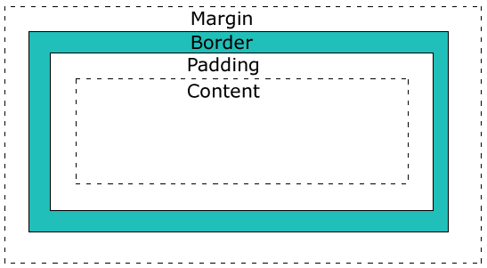
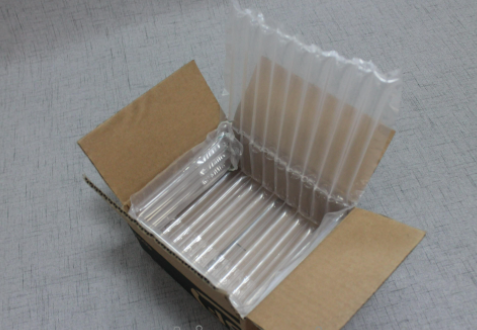
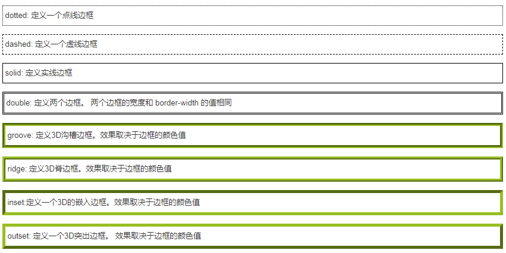
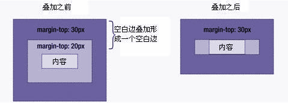
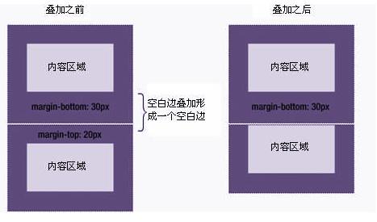
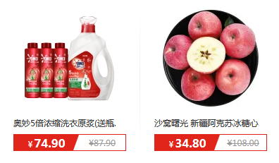
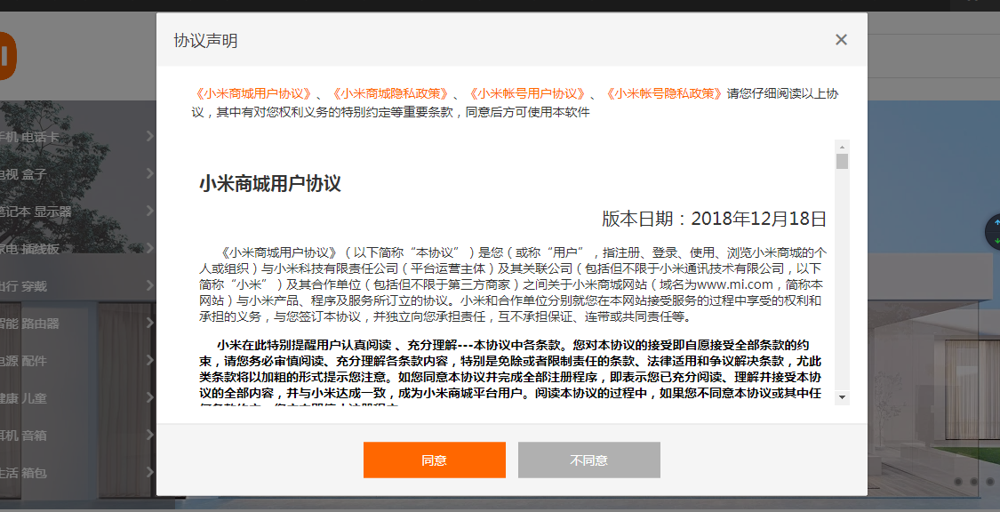

# day04

# 复合选择器

基础选择器: * 0  < tagName1 < class10 < id100< 行内样式  1000 权重(优先级)

概述：由两个或多个基础选择器通过不同的方式组合而成的选择器

### 常用复合选择器

#### 后代元素选择器

- 语法

  -  E F{ 样式声明 }
  -  描述：【空格】连接一个或多个选择器

- 作用

  - 选择E元素内部包含的所有F元素

- 代码示例

  ```css
  .box span{
  	background-color:red;
  }
  
  <div class="box">
  	<span>span1是子元素</span>
  	<p>
  		<span>span2是子元素的子元素</span>
  	</p>
  </div>
  //.box内部的所有span变成了红色，包含在.box内部的通称为后代
  ```

#### 子元素选择器

- 语法

  - 示例：E > F { 样式声明 }
  - 描述：【大于】号 连接一个或多个选择器

- 作用：选择E元素内部包含的所有直接子元素F（第一嵌套层级）
  
  ```
  .box > span{
  	background-color:red;
  }
  
  <div class="box">
  	<span>span1是子元素</span>
  	<p>
  		<span>span2是子元素的子元素</span>
  	</p>
  </div>
  /*只有span1变成了红色*/
  ```

#### 相邻选择器

- 语法

  - 示例：E+F{ 样式声明 }
  - 描述：【加号】 连接一个或多个选择器

- 作用：E元素之后紧跟着的兄弟元素F

- 代码示例

  ```
  .box + p{
  	background-color:red
  }
  
  <p>这个P元素不会被应用样式</p>
  <div class="box">box</div>
  <p>这个P元素会被应用样式</p>
  <p>这个P元素不会被应用样式</p>
  ```

#### 交集选择器

- 语法

  - 示例：E.F{ 样式声明 }
  - 描述：【无连接符】

- 作用: 选择同时被所有选择器交集选中的元素

- 代码示例

  ```
  p.box{
  	background-color:red;/*只对div有效*/
  }
  
  <p class="box">这个元素会被应用样式</p>
  <div class="box">这个元素不会被应用样式</div>
  ```

#### 并集选择器

- 语法

  - 示例：E，F{ 样式声明 }
  - 描述：【逗号】 连接一个或多个选择器

- 作用：使用逗号分隔的列表来对选择器进行分组，给列表中每一个选择器选中的元素设置样式

  ```css
  /*不使用并集选择器*/
  .box{
       color:Red;
  }
  div{
        color:red;
  }
  #test{
         color:red;
   } 
   
  <p class="box">p1</p>
  <div>div</div>
  <span id="test">span</span>
  ```

  ```css
  /*使用并集选择器——精简代码*/
  .box,div,#test{
      color:red;
  }
  ```

  

#### 伪类选择器

超链接的四种状态伪类

- 语法：【冒号：】连接

  ```css
  a:link{ css样式 }链接未被访问
  a:visited{ css样式 }链接被访问过后
  a:hover{ css样式 }链接被鼠标悬停
  a:active{ css样式 }链接被激活（鼠标按下不抬起时）
  ```

- 总结：
  （1）注意书写顺序 l-h-v-a，
  （2）实际工作中最常用的是:hover,
  （3）可以与其它选择器结合灵活使用
  
  ```
  .box a:hover{ color:red; }   .box内部的a鼠标滑过时
  .abox:hover {color:green;}   .abox鼠标滑过时
  .abox:hover > span{color:red;}  .abox滑过时它内部的直接子元素span
  ```

# CSS 盒模型

布局：位置，大小

## 学习目标

- 能够说出盒模型的概念
- 熟练运用边框属性实现边框效果与小三角
- 能够说出margin值的问题及解决
- 能够使用盒模型完成课堂案例
- 掌握overflow的应用

## 概述

CSS 盒模型本质上是一个盒子，封装周围的 HTML 元素，它包括：有效内容区域(width,height),内边距padding,边框border,外边距margin。（即装东西的容器）

所有 HTML 标签可以看作盒子，在 CSS 中，"box model" 这一术语是用来设计和布局时使用的。
（即网页布局 就是利用 CSS 摆盒子）





## 内容 content

概述 ：CSS通过为元素设置width和height属性值来规定元素的content内容区域的大小。
元素的内容及子元素默认从内容区域开始排列。

### width

- 作用：设置宽度
- 取值

  - auto默认值。浏览器可计算出实际的宽度。
  - px
  - 百分比

### height

- 作用：设置高度
- 取值

  - auto默认值。浏览器可计算出实际的宽度。
  - px
  - 百分比

==html的宽高==

```css
html {
    width:100%; //html元素取浏览器可视区域宽度作为自己的宽度
    height:100%;//html元素取浏览器可视区域高度作为自己的高度
}
```

==其余元素宽高 100% 都是取父盒子的宽高100%！！！==

## 边框 border

边框是围绕内容和内边距之间的一条或多条线，通过边框属性指定一个元素的边框的宽度、样式和颜色

### border-width边框宽度

- 作用

  - 设置所有边框宽度，或者单独地为各边边框设置宽度

- 取值

  - 长度值
  - 不允许指定负长度值。

- 语法

  - 空格隔开1-4个值

    - 1个值 设置所有边框宽度
    - 2个值 设置上下、左右
    - 3个值 设置上、左右、下
    - 4个值 设置上、右、下、左

### border-style边框样式

- 作用：设置标签所有边框的样式，或者单独地为各边设置边框样式。

- 取值

  - none 定义无边框。
    
  - dotted 定义点状边框。
    
  - dashed 定义虚线。
    
  - solid 定义实线。
    
  - double 定义双线。双线的 宽度等于 border-width 的值。
    
  - 其他（了解——掌握以上5个即可）

    

- 语法

  -  1-4个值 【空格隔开 】
    
  - 1个值 设置所有边框
    
    - 2个值 设置上下、左右
    - 3个值 设置上、左右、下
    - 4个值 设置上、右、下、左

- 注意：只有当这个值不是 none 时，边框才可能出现。如果边框样式是 none，边框宽度实际上会重置为 0

### border-color 边框颜色

- 作用：设置所有边框颜色，或者单独地为各边边框设置颜色
- 取值

  -  颜色的名称，如 "red"
  -  RGB 值, 如 "rgb(255,0,0)"
  - 16进制值, 如 "#ff0000"

- 语法

  - 1-4个值【空格隔开】
    - 1个值 设置所有边框
  - 2个值 设置上下、左右
    - 3个值 设置上、左右、下
    - 4个值 设置上、右、下、左

```
.box{
    width:100px;
    height:100px;

    /* 边框 宽度  上下 左右 */
    /* border-width:1px 10px*/  
    /* 边框 样式 */
    /* border-style:solid dashed double; */
    /* 边框 颜色  上 右 下 左 */
    border-color:red blue green yellow; 

}
```

### 简写

#### 定义四个边

- 语法：border:样式 宽度 颜色 
  
  ```
    .box{
        width:100px;
        height:100px;
  
      /* 四个边简写 */            
      /* border:10px solid red; */
            
   }
  ```

#### 单个方向定义

说明：每个边框都可以设置样式宽度颜色
语法：border-方向：宽度 样式 颜色 【空格隔开】

#### 拆分语法

- border-方向-width:
- border-方向-color
- border-方向-style

```
.box{
            /* 单个边简写 */
            border-left:10px solid red;
            border-right:10px solid green;
            border-top:10px solid pink;
            /* border-bottom:10px solid red; */

            /* 单个边拆分的写法 */
            border-bottom-width:10px;
            border-bottom-style:solid;
            border-bottom-color:yellow;
}
```

	注意:边框会影响盒子实际大小，样式、宽度、颜色无书写顺序要求

==边框的添加也会撑大盒子模型！！！也是需要内减的！！！一个盒子可以w,h 为0  光有边框也行==

## 内边距 padding

CSS padding（内边距）属性，定义元素边框与元素内容之间的空间。
padding 可以单独改变元素的上、下、左、右边距，也可以一次改变所有的属性。

==内容与盒子边界距离！！==

### 单个方向设置

- padding-bottom 设置标签的下内边距。
- padding-left 设置标签的左内边距。
- padding-right 设置标签的右内边距。
- padding-top 设置标签的上内边距。

### 取值

- px 

- 默认值0

- 百分比

- 不可使用负值

  ==内边距不能放内容，但是可以填充背景色！！！！==

```
.box{
	width:200px;
	background-color:red;
	
	padding-left:10px;
	padding-right:20px;
	padding-top:30px;
	padding-bottom:40px;
}
```

### 简写

padding 简写属性在一个声明中设置所有填充属性。该属性可以有1到4个值。

- 语法：padding：1-4个值 【空格隔开】
- 规则：
  - 1个值：表示【四个方向】的内边距值
  - 2个值：分别表示【上下，左右】的内边距值
  - 3个值：分别表示【上，左右，下】的内边距值
  - 4个值：分别表示【上，右，下、左】的内边距值

```
.box{
	width:200px;
	background-color:red;
	padding:10px; 四个方向都是10px
	padding:10px 20px; 上下为10px 左右20px
	padding:10px 20px 30px; 上10px 左右20px 下30px
	
	padding:10px 20px 30px 40px;上右下左
}
```

==设置内边距，撑大盒模型，需要内减计算！ 在width，height属性上去减！==

## 外边距margin

概述：用于设置盒子与盒子之间的距离。margin 可以单独改变元素的上，下，左，右边距，也可以一次改变所有的属性

==左上外边距可以移动盒子位置 ，右下不可以移动盒子位置，但是可以设置盒子与盒子之间的距离！！！==


>+margin-left 向右移动
>
>-margin-left 向左移动
>
>top外边距用法一样

### 单个方向定义

-  margin-bottom 设置下内边距。
-  margin-left 设置左内边距。
-  margin-right 设置右内边距。
-  margin-top 设置上内边距。

```
.box{
	width:200px;
	background-color:red;
	
	margin-left:10px;
	margin-right:20px;
	margin-top:30px;
	margin-bottom:40px;
}
```

### 简写

- 语法：空格隔开
- 取值：1-4个规则与padding值 一致

- 取值

  - px,
  - auto浏览器自动计算
  - 允许使用负值


```
.box{
	width:200px;
	background-color:red;
	
	margin:10px 20px 30px 40px;
}
```

### 外边距应用

- 外边距实现已知宽度的块级盒子居中

```css
.box{
   width:200px;
 	/* 
 	margin-left:auto;
    margin-right:auto;
   */ 
   margin:0 auto;
}
```


### 外边距问题

#### 典理情形一



- 结构关系：嵌套块元素的垂直外边距塌陷

- 问题描述 ：当父元素没有padding,margin,border时子元素与父元素直接相临，子元素的margin值会传递给父元素并且再次与父元素的margin值发生合并最终的结果最终结果是正值取两者中的较大值，负值取绝对值较大的值

- 表现：父子元素公用一个外边距

  ```css
  .parent{
      width:100px;
      height:100px;
      background-color:red;
      
  }
  .child{
  	 width:100px;
      height:100px;
      background-color:green;
      
      margin-top:100px;
      margin-bottom:100px;
  }
  ```

  ```html
  <div class="parent">
  	<div class="child">
  	
      </div>
  </div>
  ```

- 解决方法

  - 给父元素设置边框或内边距（慎用）
  - 父元素overflow:hidden,改变渲染规则

#### 典型情形二



- 结构 关系：相邻元素垂直外边距合并

- 问题描述 ：当两个块级兄弟元素垂直方向上的margin值直接相遇,会发生合并，最终结果是正值取两者中的较大值，负值取绝对值较大的值

- 表现：两个外边距合并成一个

  ```
  .box1{
      width:100px;
      height:100px;
      background-color:red;
      margin-bottom:100px;
  }
  .box2{
  	 width:100px;
      height:100px;
      background-color:green;
      
      margin-top:100px;
  }
  ```

  ```
  <div class="box1">
  	<div class="box2"></div>
  </div>
  ```

- 解决方法

  - 方法1.尽量只定义其中一个的margin值
  - 方法2.给其中一个盒子加父元素overflow:hidden,改变渲染规则
  
- 其他情况同上【简单带过——如后代元素出现同类问题等】


# overflow详解

概述：溢出元素内容区的内容会如何处理

一属性多个用途！！！

(1)触发BFC规则

(2)溢出处理

## 取值 

- visible	默认值。内容不会被修剪，会呈现在元素框之外。
- hidden	内容会被修剪，并且其余内容是不可见的。
- scroll	内容会被修剪，但是浏览器会显示滚动条以便查看其余的内容。
- auto	如果内容被修剪，则浏览器会显示滚动条以便查看其余的内容。
  overflow-x
- overflow-y

```
.box{ 
	width:200px;
	height:200px;
	border:1px solid red;
	overflow:auto;
}
```

```
<div class="box">
【环球网军事报道 特约记者 杨铁虎】4月22日-24日，第九届世界雷达博览会在江苏南京国际博览中心隆重举行。作为承办单位，中国电子科技集团公司第十四研究所（简称中国电科14所）以“科技改变生活、铸造大国重器”为主题精彩亮相，通过实物、模型、图像以及视频等多种形式展示了多款先进的军用雷达，引发国内外广泛关注。 
</div>
```


## 应用

- 产品描述的溢出隐藏



- 模块溢出显示滚动条

