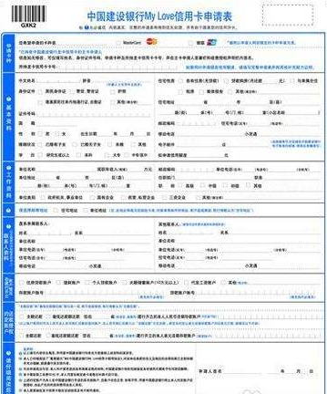
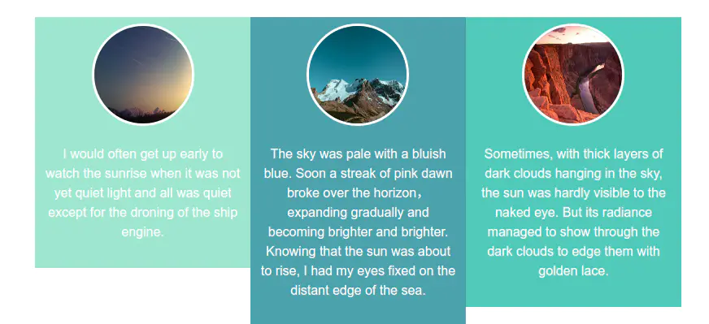
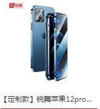

# HTML表单

## 学习目标

- 能够说出表单组成部分
- 掌握HTML常用表单元素
- 掌握HTML常用表单属性

## 概述

表单的作用：用于搜集不同类型的用户输入

表单的组成：表单元素（控件）、表单区域

生活中的表单：



网页中的表单：


## 表单元素

表单元素是允许用户在表单中输入内容的标签，
比如：文本域、下拉列表、单选框、复选框等。

### 表单元素标签

#### input标签

- 概述：\<input> 标签是最重要的表单元素。
  type属性取值不同，可以展示出不同的表单形式
- 作用：用来定义不同种类的输入控件
- 语法：\<input type="类型">
- 常用类型9种

  - type="text" 

    - 作用：用于文本输入的单行输入字段
    - 代码演示

  - type=”password”

    - 作用：定义密码字段。
    - 代码演示
    - 注意：该字段中的字符被掩码（显示为星号或实心圆）

  - type=”radio” 

    - 作用：定义单选按钮，允许用户在有限数量的选项中选择其中之一（需要指定单选按钮组）
    - 代码演示

  - type=”checkbox”

    - 作用：定义复选框，允许用户在有限数量的选项中选择零个或多个选项
    - 代码演示

  - type=”button“

    - 作用：定义普通按钮
    - 代码演示
    - 注意：Value属性定义按钮显示的文本

  - type=”submit”

    - 作用：定义用于向表单处理程序提交表单的按钮
    - 注意：省略了提交按钮的 value 属性，该按钮将显示默认文本”提交”（不同浏览器表现不同）
    - 代码演示

  - type="reset"

    - 作用：定义重置按钮，将表单元素的value属性值重置为它最初的默认状态
    - 注意：省略了提交按钮的 value 属性，该按钮将显示默认文本”重置”（不同浏览器表现不同）
    - 代码演示

  - type="image"

    - 作用：定义图像形式的提交按钮。
    - 属性

      - src=""：指定图片地址
      - alt=""：指定替换文本
      - 注意：src 属性和alt 属性必须与 \<input type="image"> 结合使用

    - 代码演示

  - type="file" 

    - 作用：用于文件上传
    - 代码演示

#### textarea标签

- 作用：定义多行输入字段（文本域）
- 语法：\<textarea>初始值\</texarea>
- 注意：不能够使用value属性规定它的初始值，初始值在开始和结束标签之间设置
- 代码演示

#### select标签

- 概述：select标签用于定义下拉列表，下拉列表种通过option标签定义选项

- 语法

  - \<select name="" id=""> 
        \<option value="">北京\</option>
        \<option value="">上海\</option>
        \<option value="">天津\</option>
    \</select>

- 代码演示

- 学员练习+讲师巡班：以上课堂代码

### 表单元素属性

- name属性

  - 作用:定义表单元素的名称，用于在 JavaScript 中引用元素，或者在表单提交后引用表单数据
  - 注意：name属性是必须的，只有设置了 name 属性的表单元素才能在提交表单时传递它们的值
  - 代码演示

- value属性

  - 作用：规定输入字段的初始值和修改按钮上的文字内容
  - 代码演示

- readonly属性

  - 作用：规定输入字段为只读（不能修改）
  - 代码演示

- disabled 属性

  - 作用：规定输入字段是禁用的，被禁用的表单元素不能编辑也不能被提交
  - 代码演示

- maxlength属性

  - 作用：maxlength 属性，规定输入字段允许的最大长度
  - 代码演示

- selected 属性

  - 作用：规定\<select>的选项\<option>在页面加载时预先选定该选项。
  - 代码演示

- size属性

  - 作用：规定下拉列表中可见选项的数目
  - 代码演示

## 表单元素标注

- 作用：为 input 元素定义标注（标记）
  通过\<label> 标签的 for 属性值与相关元素的 id 值相同，绑定表单元素
- 语法：\<label for="">\</label>
- 效果描述：当用户选择该标签时，浏览器就会自动将焦点转到和标签相关的表单控件上

## 表单区域

### form标签

- 语法：\<form>\</form>
- 作用：定义 HTML 表单域，是一个包含表单元素的区域。实现用户信息的收集和传递。举例说明：比如最为常见的交互操作，注册会员、跟帖留言或者文章发布等
- 注意：form表单实现上述操作是最为常见方式之一，也可以使用其他方式，比如ajax等

### form的属性

- action属性

  - 作用：表单的动作属性，定义了目的文件的文件名
    由动作属性定义的这个文件通常会对接收到的输入数据进行相关的处理。
    可以是绝对路径或相对路径也可以是接收数数据的email邮箱地址
  - 注意：如果省略 action 属性，则 action 会被设置为当前页面。
  - 代码演示

- method属性

  - 作用：规定发送表单数据的 HTTP 方法
  - 取值：get(默认)/post
  - get 方法：将表单中数据的按照 variable=value 的形式，添加到 action 所指向的【 URL 后面，并且两者使用“?”连接】，而各个变量之间使用“&”连接
  - post方法：将表单中的【数据放在 form 的数据体】中，按照变量和值相对应的方式，传递到 action 所指向 URL。
  - 代码演示
  - get 和 post 区别（了解）
    简单阐述，当前阶段不作为重点

    - 用途：get 从指定的资源请求数据,是用来从服务器上【获得数据】，而 POST - 向指定的资源提交要被处理的数据,是用来向服务器【上传递数据】
    - 安全性：【get 是不安全的】，因为【规定发送表单数据的 HTTP 方法（get 或 post）：】，一些系统内部消息将会一同显示在用户面前。【post 的所有操作对用户来说都是不可见的】
    - 数据量：【get 传输的数据量小】，这主要是因为受 URL 长度限制；而 post 可以传输大量的数据，所以上传文件只能使用 post（当然还有一个原因，将在后面的提到）。

  


# HTML参考手册

- 作用

  - 帮助我们快速查阅完整的html元素并给出目标元素的相应释义
  - 方便我们学习和使用
  - 经常查阅文档是一个好的学习习惯    

- 推荐的网址

  - W3C :  http://www.w3school.com.cn/
  - MDN: https://developer.mozilla.org/zh-CN/
  - css在线手册https://www.xp.cn/css3/


# CSS 用户界面

学习目标

- 掌握如何清除表单输入框的轮廓线、禁止多行文本输入框重置大小
- 掌握如何定义鼠标样式

## 轮廓线

概述：轮廓（outline）是绘制于元素周围的一条线，位于边框边缘的外围，可起到突出元素的作用。
轮廓（outline）属性指定元素轮廓的样式、颜色和宽度。

outline简写

- 在一个声明中设置所有的轮廓属性。
- 可以设置的属性分别是（按顺序）：
  outline-color, outline-style, outline-width

  - 说明：轮廓样式 outline-style
    轮廓颜色 outline-color，轮廓宽度 outline-width
  - 语法：空格隔开
  - 取值：参考边框

- 注意：

如果不设置其中的某个值，也不会出问题，比如 outline:solid #ff0000; 也是允许的。

	- 代码演示：清除与设置 input的轮廓线

## 重置元素大小

默认：文本域可以用户可以通过鼠标拖拽改变大小resize: none指定一个元素不允许用户调整大小


## CSS 鼠标样式

通过在CSS中，cursor属性指定鼠标指针放在一个元素边界范围内时所用的光标形状

- 常用值

  - 默认值：	auto
    default	默认光标（通常是一个箭头）
    auto	默认。浏览器设置的光标。
    crosshair	光标呈现为十字线。
    pointer	光标呈现为指示链接的指针（一只手）
    move	此光标指示某对象可被移动。
  - 代码演示

- 其他值

  ```
  e-resize	此光标指示矩形框的边缘可被向右（东）移动。
  ne-resize	此光标指示矩形框的边缘可被向上及向右移动（北/东）。
  nw-resize	此光标指示矩形框的边缘可被向上及向左移动（北/西）。
  n-resize	此光标指示矩形框的边缘可被向上（北）移动。
  se-resize	此光标指示矩形框的边缘可被向下及向右移动（南/东）。
  sw-resize	此光标指示矩形框的边缘可被向下及向左移动（南/西）。
  s-resize	此光标指示矩形框的边缘可被向下移动（南）。
  w-resize	此光标指示矩形框的边缘可被向左移动（西）。
  text	此光标指示文本。
  wait	此光标指示程序正忙（通常是一只表或沙漏）。
  help	此光标指示可用的帮助（通常是一个问号或一个气球）。
  ```

# 布局技巧

## 等高布局

等高布局是指多列子元素在父元素中实现等高视觉效果的布局技巧。





### 实现要点（需求）

- 多列
- 每一列背景不同
- 其中任意一列变高，其它列同步变高

### 方法一内外边距相消

伪等高

```
    <div class="wrap">
        <div class="left">当前，新冠疫情的防疫已进入新常态新阶段，如何防患于未然，把基层常态化防控的藩篱扎得更牢，显得愈加重要。今天，雨绸缪为未来应对重大呼吸疾病做好更充分的准备，同时开展一对一的心理关爱计划，为奋战在一线的白衣</div>
        <div class="center">当前，新冠疫情的防疫已进入新常态</div>
        <div class="right">当前，新冠疫情的防疫已进入新常态新阶段，如何防患于未然，把基层常态化防控的藩篱扎得更牢，显得愈加重要。今天，星巴</div>

    </div>
```

```
.wrap{
            width:600px;
            border:10px solid #000;
            overflow: hidden;
        }
        .wrap::after{
            content:"";
            display: block;
            clear: both;
        }

        .left,.center,.right{
            /* 内边距填充背景色 */
            padding-bottom: 999px;
            /*
            外边距抵消内边距 保证盒子的有效高度height不变 
            而父盒子的高度取决于最高列的高度 在父盒子里写overflow:hidden
            即可将溢出的背景色部分切掉 留下在父盒子里的背景色 给人一种视觉上的等高
            
             */
            margin-bottom: -999px;
            /* 盒模型高度 = height + padding-bottom 999px-margin-bottom 999px */
        }

        .left{
            width:200px;
            /* 最小高度 ----指定盒子可以大于等于100px */
            min-height:100px;
            background-color:pink;
        }
        .center{
            width:200px;
            /* 最小高度 ----指定盒子可以大于等于100px */
            min-height:100px;
            background-color:yellowgreen;
        }
        .right{
            width:200px;
            /* 最小高度 ----指定盒子可以大于等于100px */
            min-height:100px;
            background-color:skyblue;
        }

```

### 原理:

​     利用 内边距填充背景色，设置一个较大的下内边距值，
​     外边距抵消内边距 保证盒子的有效高度height不变 
​     而父盒子的高度取决于最高列的高度 在父盒子里写overflow:hidden
​     即可将溢出的背景色部分切掉 留下在父盒子里的背景色 给人一种视觉上的等高
​            

### 实现步骤

- 通过浮动创建一个正常的三列布局（不同列背景不同）
- 父容器清浮动
- 每一列固定padding-bottom，同时指定一个margin负值，抵消padding的占位
- 父容器overflow:hidden;


## 方法二背景盒子法

原理：盒子层层嵌套，利用内层盒子高度变化，外层盒子的高度也会同步变化


真等高

### 实现步骤

- 准备三个负责背景的盒子.bg1,.bg2,.bg3，HTML结构上层层嵌套
- 将.left,.center,.right盒子放入最内层的背景盒子.bg3里
- 最内层的盒子.bg3清浮动
- 将.bg2,.bg3相对于当前位置进行移动，形成三列背景效果
- 将.left,.center通过margin负值移动到对应的背景处即可

```html
 <div class="wrap">
        <div class="bg1">
            <div class="bg2">
                <div class="bg3">
                    <div class="left">1当前，新冠疫情的防疫已进入新常态新阶段，如何防患于未然，把基层常态化防控的藩篱扎得更牢，显得愈加重要。今天，雨绸缪为未来应对重大呼吸疾病做好更充分的准备，同时开展一对一的心理关爱计划，为奋战在一线的白衣</div>
                    <div class="center">2当前，新冠疫情的防疫已进入新常态</div>
                    <div class="right">3当前，新冠疫情的防疫已进入新常态新阶段，如何防患于未然，把基层常态化防控的藩篱扎得更牢，显得愈加重要。今天，星巴</div> 

                </div>
            </div>
        </div>
    </div>
```

```css
 .wrap{
            border:1px solid #000;
            width:600px;
            overflow: hidden;

        }
        .bg1{
            background-color: pink;
        }

        .bg2{
            background-color: skyblue;
            position:relative;
            left:200px;
        }
        .bg3{
            background-color: orange;
            
            position:relative;
            left:200px;
        }


        .left,.center,.right{
            width:200px;
            float:left;
            min-height:100px;
        }

        .left{
            margin-left:-400px;
        }
        .center{
            margin-left:-200px;
        }

        .bg3:after{
            content:"";
            display: block;
            clear: both;
        }
```

### 优缺点

- 结构复杂
- 可以创建任意列数
- 方便通过百分比实现自适应


# 溢出显示省略号



### 单行文本溢出显示省略号

```
.box {
    width: 200px;
    line-height:30px;
    height:90px;
    background-color: red;

    white-space:nowrap;
    text-overflow:ellipsis;
    overflow: hidden;
}


```

### 多行文本溢出显示省略号

- 方法一：after实现

  ```css
  .box {
      width: 200px;
      line-height:30px;
      height:90px;
      background-color: red;
  
      position:relative;
      text-align:justify;
      overflow: hidden;
  }
  
  .box:after{
      content:"...";
      position:absolute;
      right:0;
      bottom:0;
      background-color: red;
  
      width:1em;
  }
  ```

  该方法适用范围广，但文字未超出行的情况下也会出现省略号,可结合js优化该方法。

  说明：

  1. 将height设置为line-height的整数倍，防止超出的文字露出。
  2. 给p::after添加渐变背景可避免文字只显示一半。
  3. 兼容ie8需要将::after替换成:after。

- 方法二：弹性盒

  ```
  .box {
      width: 200px;
      line-height:30px;
      
      background-color: red;
  
      /* 旧版弹性盒 */
      display:-webkit-box;
              /* 弹性盒子元素垂直排列 */
      -webkit-box-orient: vertical;
               /* 控制要显示的行数 */
      -webkit-line-clamp: 4;
      
      overflow: hidden;
  }
  ```

  注意：因使用了WebKit的CSS扩展属性，该方法适用于WebKit浏览器及移动端

  说明：

  ```
  -webkit-line-clamp 用来限制在一个块元素显示的文本的行数。 为了实现该效果，它需要组合其他的WebKit属性。常见结合属性：
  display: -webkit-box; 必须结合的属性 ，将对象作为弹性伸缩盒子模型显示 。
  -webkit-box-orient 必须结合的属性 ，设置或检索伸缩盒对象的子元素的排列方式 。
  ```

  