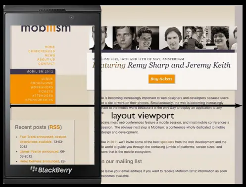
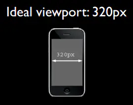
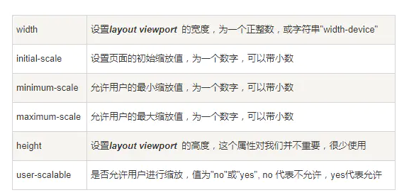
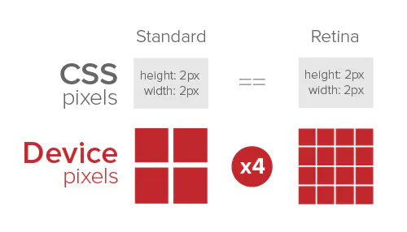
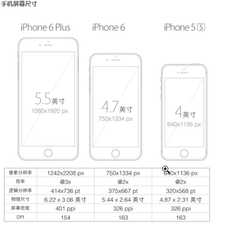
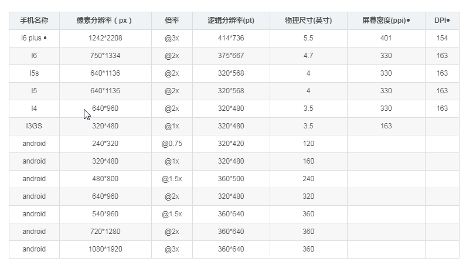
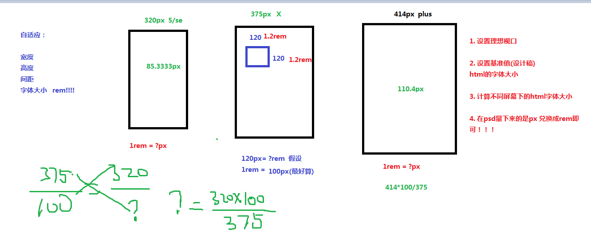
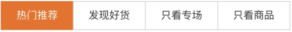

day16-day17

## 1.设备划分

> pc端大屏  > 1200px
>
> 超小屏 :phone  320px-768px 
>
> 小屏; pad  768px-1024px
>
> 中屏: 992px-1200px

## 2.视口

移动设备上的viewport就是设备的屏幕上能用来显示我们的网页的那一块区域，在具体一点，就是浏览器上用来显示网页的那部分区域，但viewport又不局限于浏览器可视区域的大小，它可能比浏览器的可视区域要大，比如布局视口开始为了在手机上展示pc端页面就设置为980px的宽度.

2个视口总结如下：

-  layout viewport(布局视口)：在PC端上，布局视口等于浏览器窗口的宽度。而在移动端上，由于要使为PC端浏览器设计的网站能够完全显示在移动端的小屏幕里，此时的布局视口会远大于移动设备的屏幕，宽度一般为980px。
-  ideal viewport(理想视口)：布局视口的一个理想尺寸，只有当布局视口的尺寸等于设备屏幕的尺寸时，才是理想视口。
- 




#### 利用meta标签对viewport进行控制

移动设备默认的viewport是layout viewport，也就是那个比屏幕要宽的viewport，但在进行移动设备网站的开发时，我们需要的是ideal viewport。那么怎么才能得到ideal viewport呢？这就该轮到meta标签出场了。

我们在开发移动设备的网站时，最常见的的一个动作就是把下面这个东西复制到我们的head标签中：

```css
<meta name="viewport" content="width=device-width, initial-scale=1.0, user-scalable=no">

device-width设备宽度  width=device-width   视口宽度= 设备宽度
```




## 3.逻辑像素和物理像素

物理像素: 生活当中

逻辑像素（设备独立像素）: css像素 写代码



分辨率:ppi

手机尺寸:对角线长度(英寸)



pc 端: 1物理= 1逻辑 = 1csspx      倍率= 物理像素/逻辑像素

移动端: 1逻辑像素  = 1css像素




#### 3.1二倍图技术

`为了保证图片在移动端的正常展示,我们需要2倍图才能正常呈现 ,也就是说我们的图片比我们插入图片的盒子宽高要大两倍`

`所以写代码时 我们要将图片缩小2倍 再插入到盒子里 才能保证图片不失真.`

```css
background-size:图片/2px  图片/2px;
background-position: xpx/2 ypx/2; 
```


## 4.屏幕宽度获取

#### 4.1. h5媒体查询

```css
@media  设备类型   and  (查询条件)  {
    
    //代码  只有查询条件被满足才会执行这里的代码
}

设备类型:  screen设备屏幕      print 打印机

@media   screen   and  (width:414px) {
    
    .box {
        baclground-color:red;
    }
    
}
@media   screen   and  (min-width:414px) {
    //大于等于 414px 宽度的屏幕
    .box {
        baclground-color:yellow;
    }
    
}
@media   screen   and  (max-width:992px) {
    //小于等于 992px 宽度的屏幕
    .box {
        baclground-color:blue;
    }
    
}

992px ---1200px 需求
@media   screen   and  (max-width:1200px)  and  (min-wdith:992px ){
    //小于等于 992px 宽度的屏幕
    .box {
        baclground-color:orange;
    }
    
}
```

例子:  

320px屏幕的话   box盒子的颜色是绿色

320px-375px之间屏幕  蓝色

375px-414px 之间屏幕的话  红色

414px -540px 黄色

 大于540px 以上黑色

#### 4.2. js获取视口的宽度

```css
var screenWidth = document.documentElement.clientWidth;
```


## 5. 移动端主流布局方案

#### 5.1 rem布局

```css
rem: 相对单位          相对于html元素的font-size值
em : 相对单位          相对于父盒子身上的字体大小font-size 
```

`==原理==:`在不同设备屏幕宽度下设置不同的html字体值大小,将设计稿下测量出来的px值兑换成rem值即可


`注意`: 设计稿宽度不一定都是750px ,不管是什么宽度值,只需要预设一个html字体值 得到设计稿下

1rem = 100px  ,这个100px就是为了好算,也可以设置成20px ,50px等等..


#####      5.1.1 rem+媒体查询布局

步骤:

>    1. 先设置视口 meta viewport 理想视口
>
>    2. 写媒体查询的适配文件 (在不同屏幕下设置不一样html字体值,兑换不一样的像素)
>
>        750px---100px   320px---?px  当前屏幕的html字体大小 = 当前屏幕宽度*预设字体大小/psd设计稿的宽度;
>
>      3. 在设计稿下去测量 px  转换为rem  (px/100) 写rem 单位



媒体查询适配文件代码:

```css
/* 750px 设计稿 
  rem 单位
  300px*200px 得想px兑换rem 
  1rem = 100px;
  html {
      font-size:100px;
  }

*/
@media screen and (min-width:320px) {

    /* ? = 320px*100 / 750px */
    html {
        font-size: 46.67px;
    }

}
@media screen and (min-width:360px) {

    /* ? = 360px*100 / 750px */
    html {
        font-size: 46.67px;
    }

}
@media screen and (min-width:375px) {

    /* ? = 375px*100 / 750px */
    html {
        font-size: 50px;
    }

}
@media screen and (min-width:414px) {

    /* ? = 414px*100 / 750px */
    html {
        font-size: 55.2px;
         
    }

}
@media screen and (min-width:540px) {

    /* ? = 540px*100 / 750px */
    html {
        font-size: 72px;
    }

}
@media screen and (min-width:640px) {

    /* ? = 640px*100 / 750px */
    html {
        font-size: 85.33px;
    }

}
@media screen and (width:750px){

    html {
        font-size: 100px;
    }

}
```


#####      5.1.2 rem+js查询布局

``` javascript
js适配文件:
// 适配代码  

//当前屏幕宽度 

var  screenWidth = document.documentElement.clientWidth;
console.log(screenWidth);


if(screenWidth>750){
    screenWidth= 750;
}


//设计稿下预设html字体基础值 100px

var psd_baseFS = 100;

//设计稿宽度 psd:750px,640px,375px...

var psdWidth = 750;
//计算出来当前屏幕字体值 赋值 给当前html元素的字体属性里
document.documentElement.style.fontSize = screenWidth*psd_baseFS/psdWidth+'px';
```


#### 5.2 视口单位vw布局

浏览器内部  vw ,vh 

vw: viewport width  视口宽度

vh: viewport height  视口高度

规定: 

屏幕宽度: 等分 100份  = 100vw 

屏幕高度:等分 100份  = 100vh

`适配:`

> 375px屏幕宽度 = 100vw  那么1vw = 3.75px   如果设计稿下量下来 width:200px    转换为vw 就= 200/3.75vw
> 如果直接拿vw和px做兑换,计算会非常麻烦!为了好计算我们可以找px和rem和vw的关系!!!

> 1vw = 3.75px    1px= 0.266666666667vw;   
> 375px屏幕宽度  html {font-size:50px};  1rem = 50px = 50*0.266666666667vw = 13.3333333333vw;
> 通过以上计算表明: rem和px还是50倍的倍数关系 这样不就好算了嘛!!!

`适配文件:`

```css
html {
   
    font-size:13.3333333333vw;
}

px 和rem 倍数关系还是50倍  

你在设计稿 量下的大小px /50 直接写rem单位即可!!!!

```


#### 5.3移动端特殊处理

1. 点击高亮效果清除

   ```css
    -webkit-tap-highlight-color: rgba(0,0,0,0);
   ```

   

2. 在iOS上，输入框默认有内部阴影，但无法使用 box-shadow 来清除，如果不需要阴影，可以这样关闭：

```
input,
button,
textarea {　
　　-webkit-appearance: none;
}
```


3. 长按禁止弹出菜单【禁止弹出系统菜单(禁止保存或拷贝图像IOS）】

   通常当你在手机或者pad上长按图像 img ，会弹出选项 存储图像 或者 拷贝图像。

   ```css
   img,a,p {
         -webkit-touch-callout: none;
   }
   ```

   

4. css3新盒模型

   ```css
   {
     padding: 0;
     margin: 0;
     -webkit-box-sizing:border-box;
     box-sizing: border-box;
   }
   ```


5. 移动端字体类型设置

   - 各个手机系统有自己的默认字体，且都不支持微软雅黑
   - 如无特殊需求，手机端无需定义中文字体，使用系统默认
   - 英文字体和数字字体可使用 Helvetica ，2种系统都支持
     代码：

   ```css
   /* 移动端定义字体的代码 */
   body{font-family:Helvetica;}
   ```

   

6. 1px边框问题

   在移动端web开发中，UI设计稿中设置边框为1像素，前端在开发过程中如果出现border:1px，测试会发现在retina屏机型中，1px会比较粗。

   

   

   可以采用伪元素+transform模拟的方式

   代码示例：

   ```css
   /* 2倍屏下 缩小0.5倍 */
   @media screen and (-webkit-min-device-pixel-ratio: 2) {
       .pro-listBox  h3::after {
           content: " ";
          
           transform: scaleY(0.5);
       }
       .pro-listBox  h3::before {
           content: " ";
           transform: scaleX(0.5);
       }
   
   }
   
   /* 2倍屏下 缩小0.3倍 */
   @media screen and (-webkit-min-device-pixel-ratio: 3) {
       .pro-listBox  h3::after {
           content: " ";
         
           transform: scaleY(0.3);
       }
       .pro-listBox  h3::before {
           content: " ";
           transform: scaleX(0.3);
       }
   }
   
   ```

   

7. 移动端禁止选中内容

   用户可以选中页面中的内容，那么你可以在css中禁掉

   ```css
   .user-select-none {
       -webkit-user-select: none; /* Chrome all / Safari all */
     
   }
   ```

   

​    


### 自动生成css3属性的私有前缀插件

搜索autoprefixer  安装  点击右下角设置  点击安装另外一个版本  2.. 开头    ---》关闭vscode --->打开   写.css里写css3属性---》 


==ctrl+shift+p 调出命令窗口  输入autoprefixer 点一下这个插件即可使用！！！==