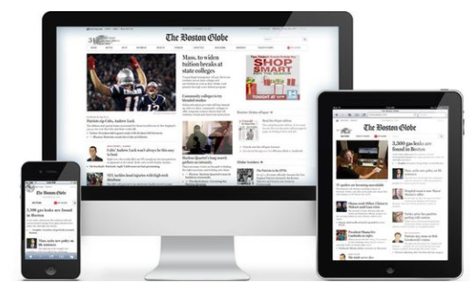

# 响应式web开发

## 学习目标

- 能够说出响应式布局，以及它的实现原理
- 能够熟练使用媒体查询
- 能够独立完成响应式项目
- 能够掌握grid常用布局属性不少于6个

## 概述（什么是响应式）

响应式设计的页面会根据用的的行为以及设备的环境(系统平台、屏幕尺寸、屏幕定向等)进行相应的响应和调整。

此概念于2010年5月由国外著名网页设计师Ethan Marcotte(伊森·马科特)所提出意在实现不同屏幕分辨率的终端上浏览网页的不同展示方式。具体的实践方式由多方面组成，包括弹性盒、弹性网格布局、响应式图片、CSS media query的使用等。



背景：移动互联网的发展，为了满足移动互联网多终端显示的需求 催生了响应式式布局的诞生，

目的：响应式网页设计就是一个网站能够兼容多个终端——而不是为每个终端做一个特定的版本。这样就可以不必为不断到来的新设备做专门的版本设计和开发了。

初步认识响应式：响应式站点演示：https://segmentfault.com/

## 响应式开发原理（实现步骤）

### 1、设置 viewport

### 2 、创建流式布局（%）

响应式在设计和布局初期就要考虑页面如何在多终端展示，因此需要根据页面效果分析创建方便后续处理版式变化的流式布局

#### 2.1 模块布局响应

对页面进行响应式的设计实现，需要对相同内容进行不同宽度的布局设计，有两种方式：桌面优先（从桌面端开始向下设计）；移动优先（从移动端向上设计）；

无论基于那种模式的设计，要兼容所有设备，布局响应时不可避免地需要对模块布局做一些变化，主要的布局方式主要有以下几种

· 模块中内容：挤压－拉伸；


 

· 模块中内容：换行－平铺；

 

l 模块中内容：删减－增加；


n模块位置的变化


 

其中涉及到的布局技巧的应用

如：百分比布局、弹性盒、弹性网格\浮动技巧、定位技巧的应用、box-sizing,显示隐藏的应用

#### 2.2响应式图片

##### 1.内容图片响应

在html页面中的图片，比如文章里插入的图片我们都可以通过css样式使用百分比，来进行控制图片缩放：

```
#wrap  img{
  width:100%;
 }
```

以上代码将强制图像占据其父元素空间的100%，当父元素宽度改变时图像元素也会相应改变，而高度默认为auto,图像自身宽高比例不会发生变化

```
#wrap  img{
  max-width:100%;  
 }
```

以上代码将实现父元素宽度小于图像本身宽度时，图像跟随父元素改变，当父元素宽度大于图片时，图片宽度以自身本身宽度显示

 

##### 2.背景图片处理

除了img标签的图片外我们经常会遇到背景图片，比如logo为背景图片：

```
#logo a{

	display:block;
​    width:100%;
​    height:40px;
​    text-indent:55rem;
​    background-img:url(logo.png);
​    background-repeat:no-repeat;
​    background-size:100% 100%;

   }
```

background-size属性值设置为百分比值或cover,contain等，将实现背景图片的大小跟随元素大小响应变化。

#### 2.3 响应式文字

相对单位在字号、行高中的应用可以一定程度上提升效率精简代码 rem/em/px

## 3、屏幕区间设定

使用[@Media查询](https://www.runoob.com/cssref/css3-pr-mediaquery.html)来设置不同屏幕区间的样式，这是响应式布局的核心

对于@Media查询的分界点，这个可以根据自己的项目来调整，设置合适自己项目的布局分界点。在设置分界点时，要注意先后顺序，当使用max-width数值大的在前面，数值小的在后面；当使用min-width时，数值小的放前面，数值大的放后面。

下面列出了在项目开发时设置的布局分界点参考：

移动端优先：

```
/*超小型设备（手机，768px以下）*/

@media screen and (min-width:768px) { ... } /* 小型设备（平板电脑，768px 以上） */

@media screen and (min-width:992px){ ... }/* 中型设备（台式电脑，992px 以上） */

@media screen and (min-width:1200px){ ... }/* 大型设备（大台式电脑，1200px 以上） */
```

 pc优先：

```
/* 大型设备（大台式电脑，1200px 以上） */

@media screen and (max-width:1200px) { ... } /* 中型设备（台式电脑，1200px 以下） */

@media screen and (max-width:992px){ ... }/* 小型设备（平板电脑，992px 以下） */

@media screen and (max-width:768px){ ... }/* 超小型设备（手机，768px 以下） */
```


## 响应式项目

### 项目介绍

- 项目名称：小U后台管理系统 
- 项目描述：小U是一套响应式跨平台电商后台管理系统包含了商品管理、订单管理、包含商品管理、订单管理、会员管理、促销管理、等模块。
  我们主要完成商品管理，商品添加页面、商品信息页
- 效果预览
- 开发工具以及技术栈

  - 开发工具

    - VScode
      Photoshop、蓝湖
      主流浏览器

  - 技术栈

    - 利用媒体查询与综合布局的形式，实现响应式
- 采取结构与样式相分离，模块化开发

### 项目搭建

- 文件目录

  - 概述：根据项目名称创建项目文件夹,推荐用对应的英文单词命名。
    html、css、img、js 文件均归档至项目名称目录中
  - 目录示例

    - 项目文件夹

      - 样式类图片文件夹（images）
      - 样式文件夹（css）
      - 字体类文件夹（fonts）
      - 脚本文件夹（js）
      - 产品类图片文件夹（upload）

- 样式文件

  - 初始化样式（base.css）
  - 公共样式(common.css)

### 项目模块化开发

- 讲解—【首页框架】
- 讲解—【左侧边栏响应式实现】
- 讲解—【右侧列表】
- 讲解—【顶部菜单小屏幕下拉效果】


## 响应式布局优缺点

优点

- 面对不同分辨率设备灵活性强,能够快捷解决多设备显示适应问题
- 节省设计、开发、维护成本【不再特定的维护PC页面，移动页面】

缺点

- 流式布局对版面设计有一定要求存在局限性
- 兼容各种设备工作量大，效率低下
- 代码累赘，会出现隐藏无用的元素，加载时间加长
- 影响用户体验(一定程度上改变了网站原有的布局结构，会出现用户混淆的情况,)
- 兼容问题（IE8以下不支持）