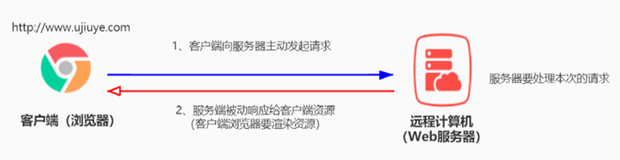
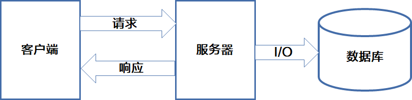
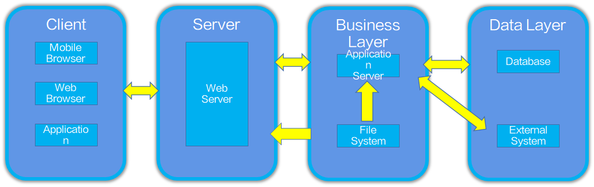
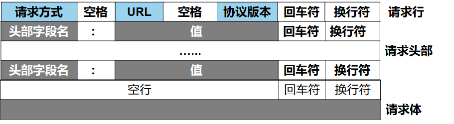
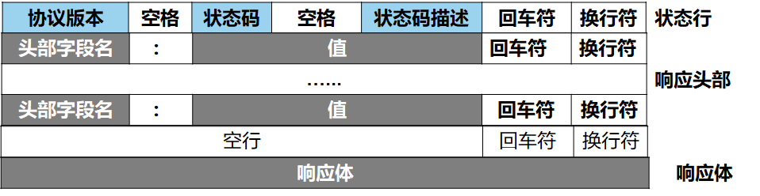

## npm与包

### 包的概念：

模块的高级包装形式就是包，与核心模块类似，就是将一些预先设计好的功能或API封装到一个文件夹，以目录形式存储，存放在“node_modules”文件夹中，提供给其他开发者使用。，注：包中最终指向还是一个模块。且模块必须遵循CommonJS规范。

### 包的版本号

一般来讲大部分的软件版本号分3段，node中的包也遵循这样的规则，比如：4.17.1

(1)第1位数字：表示大版本号，一般当软件整体重写，或出现不向后兼容的改变时，增加此位，此位是0时表示软件还在开发阶段。
(2)第2位数字： 表示功能更新，出现新功能时增加此位 
(3)第3位数字：表示小修改，如修复bug，只要有修改就增加此位

### NPM官方查看trim插件

### NPM包管理工具

Node Package Manager，简称npm包管理器，是Node内置的包管理器，安装node环境后，自动安装了npm工具，可以在命令行运行，使用npm命令下载（安装），卸载，更新，查看第三方模块
npm，全球JavaScript代码最大的开源库生态系统，该社区提供了数以亿个包模块，这些包模块实现了不同的功能。提供给需要使用的人进行下载并使用。

#### npm作用

1、从npm服务器下载其他人编写的第三方包或命令行程序到本地,供本地项目使用。
2、将自己编写的包或或命令行程序，发布到npm服务器供其他人使用。

#### npm常用命令

##### 查看版本号

```
npm  -v / -version
```

##### 初始化项目并创建package.json。

```
npm init [-y]
```

-y代表自动生成package.json。当前项目文件夹名必须没有中文、特殊符号、空格。

##### 安装插件

###### 安装全部插件包

```
npm  i / install / add
```

此命令会据根目录下的配置文件package.json，自动下载所需的模块，如果package.json 不在当前目录下，会自动寻找上级目录中是否有package.json文件，找到package.json文件后，在package.json文件的同级目录中创建node_modules文件夹，并存入下载的模块。

###### 安装指定插件

```
npm  i / install / add  包1   包2   包3 …… 
```

案例：

```
npm i express
```

```
npm install ejs swiper 
```

###### 安装指定版本插件

```
npm  i / install / add  包名@版本号
```

案例：

```
npm i express@4.16.0
```

###### 安装指定模式插件

**产品模式**：安装指定插件包的最新版本，并且保存到dependencies属性中，默认安装值。

```
npm  i / install / add  包名 [-P/  --save-prod ]
```

**开发模式**：安装指定插件包的最新版本，并且保存到devDependencies属性中

```
npm  i / install / add  包名  [-D / --save-dev]
```

###### 安装全局插件

```
npm  i / install / add  包名  -g / --global
```

此命令是将包安装到全局路径下，供整个系统使用，一般都是安装环境工具。

##### 卸载插件

```
npm  uninstall / rm / remove / r / un / unlink  包名
```

注：操作全局插件可以在任意命令行下操作，但操作项目插件，必须要在当前项目下操作。

#### npm淘宝镜像

淘宝在国内免费为开发者提供了一个服务器，专门把国外官方服务器上的包同步到国内的服务器，供国内开发者使用。极大的提高了下载包的速度。cnpm是一个功能和npm一模一样的命令工具，同样可以完成包的管理工作，同步频率目前为10分钟一次以保证尽量与官方服务同步。

**配置方法：**

1、全局cnpm：

```
npm i cnpm -g
```

2、修改下载源地址（推荐使用）

```
npm config set registry https://registry.npm.taobao.org
```

#### 包描述文件(package.json)

包描述文件用于表达非代码相关的信息，它是一个JSON格式的文件——package.json，位于包的根目录下，是包的重要组成部分。而NPM的所有行为都与包描述文件的字段息息相关。

##### 文件包含信息

(1)项目的名称、版本号、描述 
(2)项目中使用的第三方模块包（包括开发模式模块包和产品模式模块包） 

注：在项目共享的时候，需要去除node_modules，使用package.json记录第三方模块包即可。

##### 包描述文件属性说明

| **属性名**      | **描述**                             |
| --------------- | ------------------------------------ |
| name            | 项目的名字                           |
| version         | 项目的版本号                         |
| description     | 项目的描述                           |
| main            | 项目的入口文件                       |
| scripts         | 项目的启动命令                       |
| keywords        | 项目的关键词                         |
| author          | 项目的作者                           |
| license         | license证书说明(证书协议)默认值，ISC |
| dependencies    | 产品模式第三方依赖                   |
| devDependencies | 开发模式第三方依赖                   |

### 包的分类

#### 项目包

被npm命令安装到项目的node_modules 目录中的包，称为项目包。

**项目包分为两类：**

(1)开发依赖包：被记录到 devDependencies 节点中的包，只在开发期间使用。 
(2)产品依赖包：被记录到 dependencies 节点中的包，项目全过程。

#### 全局包

一般安装为全局的插件包，称为全局包，通常指(工具类的包)称为全局包。

### 包加载机制

**模块的分类**

在Node中，模块分为两类：一类是Node提供的模块，称为核心模块；另一类是用户编写的模块，称为文件模块。

#### 核心模块(内置模块)

核心模块由Node官方API内置模块，加载优先级最高。在Node进程启动时，部分核心模块就被直接加载进内存中，所以这部分核心模块引入时，文件定位和编译执行这两个步骤可以省略掉，并且在路径分析中优先判断，所以它的加载速度是最快的。

#### 文件模块

文件模块则是在运行时动态加载，需要完整的路径分析、文件定位、编译执行过程，速度比核心模块慢。文件模块分为两类自定义模块和第三方模块。

##### 自定义模块

自定义模块在引入的时候，必须指定以./或../开头的路径标识符，否则node 会把它当作内置模块或第三方模块进行加载。如果省略了文件的扩展名，则Node.js会按顺序分别尝试加载以下的文件：
(1)文件名.js 扩展名进行加载  
(2)文件名.json 扩展名进行加载
(3)加载失败，终端报错  Error: Cannot find module 'xxx'  

##### 第三方模块

如果引入的模块标识符不是内置模块，也不是自定义模块，则Node.js会从当前模块的父目录开始，尝试从当前文件夹的node_modules 文件夹中加载第三方模块，如果没有找到对应的第三方模块，则移动到再上一层父目录中，进行加载，直到当前项目文件的盘符根目录。如果没有则加载失败，终端报错  Error: Cannot find module ‘xxx’ 。

#### 模块加载机制： 


#### 第三方模块查找的流程： 


### package.json中的main属性

main属性，可以指定模块加载的主入口文件。

**main的三种加载机制：**

(1)根据目录下的package.json 的文件，寻找 main 属性指定的文件名，作为 require() 加载的入口。  
(2)如果目录里没有 package.json 文件，或者 main 入口不存在或无法解析，则 Node.js 将会加载目录下的 index.js 文件（所以默认目录中的默认入口为index.js）。
(3)如果以上两步都加载失败，则 Node 会在终端打印错误消息，报告模块缺失：Error: Cannot find module 'xxx'

## 服务器与客户端

### 基本概念

#### 交互模式：

B/S：指基于 浏览器（Browser） 和 服务器（Server） 这种交互形式

C/S：指基于 客户端（Client） 和 服务器（Server） 这种交互形式

#### 服务器：

在上网过程中，负责存放和对外提供资源的电脑（计算机computer），叫做服务器。与个人终端相比，服务器要求的配置和性能更高。

#### 客户端：

上网过程中，负责获取资源的电脑，叫做客户端。客户端可以有很多表现形式，如：个人电脑、手机、平板等等。客户端可以通过浏览器很方便地从服务器端获取资源。

#### 静态资源与动态资源：

静态资源：服务器端只需要读取并直接发送给客户端、不需要进一步处理的资源。

动态资源：服务器端没有现成的资源，需要服务器端动态生成的资源。

### 交互过程：



### 通信模型

请求 -> 处理 -> 响应：

请求：由客户端发起请求；
处理：由服务器端处理请求；
响应：服务器端把处理的结果，通过网络发送给客户端；



HTTP 协议会话过程的 4 个步骤
●建立连接：客户端的浏览器向服务端发出建立连接的请求，服务端给出响应就可以建立连接了。
●发送请求：客户端按照协议的要求通过连接向服务端发送自己的请求。
●给出响应：服务端按照客户端的要求给出应答，把结果（HTML 文件）返回给客户端。
●关闭连接：客户端接到应答后关闭连接

### Web应用架构



### URL地址

URL（全称是UniformResourceLocator）又称统一资源定位符，根据一个URL能够在全球互联网上确定一个唯一的资源存放位置。浏览器只有通过URL地址，才能正确定位资源的存放位置，从而成功访问到对应的资源。它包含的信息有，文件的位置，文件的类型，及浏览器的处理方式。

#### 组成

通信协议：//子域名.域名.顶级域名:端口号/目录/文件名.文件后缀?参数=值

##### 通信协议

通信协议指，客户端如何传递请求给服务器，同时服务器又以通过何种方式再把数据资源传递给客户端。都需要遵守已定的通信协议。如：http 、https、ftp、DNS、Telnet、smtp、TCP/IP等都是协议。

##### 端口号：

计算机中每一个端口号对应一个正在开启的服务。同一台计算机中同一个端口号不能被多个应用使用。

##### 路由

资源在服务器上相应的位置（不一定是具体路径，可能需要结合代码实现资源相应）

##### 参数

获取资源所需要的参数，可以是必备参数也可以是可选参数

**标识**

用来标识是否有关联资源，比如父子资源。

#### 域名与ip

#### IP：

IP用于区分互联网上每个终端的唯一标识，格式：X.X.X.X,X的取值是0~255之间。

#### 域名：

IP的字符别名，为了方便记忆而产生。通过DNS来进行IP与域名的解析。

#### DNS服务器：

用来完成IP与域名的解析。

### 互联网传输协议

#### **协议概念**

协议（ Protocol）是指双方为了完成一个目标结果所必须遵守的规则和约定。

#### http协议：

HTTP(Hyper Text Transfer Protocol)< 超文本传输协议> 的缩写. 是用于从WWW 服务器传输超文本(内容)到本地浏览器的传输协议。它规定了客户端与服务器之间进行网页内容传输时，所必须遵守的传输格式。HTTP 是一个应用层协议, 由请求和响应构成, 是一个标准的个客户端和服务器模型。通常基于TCP连接方式。

**http与https的区别**

相同点：http协议和https，都是超文本传输协议，

不同点：

1）http的参数信息是明文传输，而https的参数信息是加密传输，
2）https则是具有安全性的ssl加密传输协议。
3）端口号不同http是80，https是443

#### 交互模型（请求与响应）：

HTTP 协议采用了 请求/响应 的交互模型。也就是说必须是客户端主动发起请求，再由服务器端处理请求，同时被动的把内容响应给客户端。

##### 请求消息(请求报文)：

**描述：**由客户端发起，在客户端向服务器端发送请求时生成。

**组成：**HTTP请求消息由请求行（request line）、请求头部（ header ） 、空行 和 请求体 4 个部分组成。



#### 响应消息(相应报文)：

**描述：**根据客户端的请求信息做出的资源结果响应。

**组成：**HTTP响应消息由状态行、响应头部、空行 和 响应体 4 个部分组成。



#### 请求方式：

HTTP 请求方法，属于 HTTP 协议中的一部分，请求方法的作用是：用来表明要对服务器上的资源执行的操作。最常用的请求方法是 GET 和 POST。

**http中常见的请求方法：** 

| **请求方法** | **描述**                                                     |
| ------------ | ------------------------------------------------------------ |
| GET          | 发送请求,获得服务器上的资源，请求体中不会包含请求数据，请求数据放在协议头中 |
| POST         | 向服务器提交资源（例如提交表单或上传文件）。数据被包含在请求体中提交给服务器。 |
| PUT          | 向服务器提交资源，并使用提交的新资源，替换掉服务器对应的旧资源。 |
| DELETE       | 请求服务器删除指定的资源。使用表格展示                       |

#### 状态码：

HTTP 响应状态码（HTTP Status Code），也属于 HTTP 协议的一部分，用来标识响应的状态。

**作用：**

响应状态码会随着响应消息一起被发送至客户端浏览器，浏览器根据服务器返回的响应状态码，判断服务器端的响应结果。

**格式：**

HTTP 状态码由三个十进制数字组成，第一个十进制数字定义了状态码的类型，后两个数字用来对状态码进行细分。HTTP 状态码共分为 5 种类型。

**常见状态码：** 

| **状态码** | **描述**                                                     |
| ---------- | ------------------------------------------------------------ |
| 1**        | 信息，服务器收到请求，需要请求者继续执行操作（实际开发中很少遇到  1** 类型的状态码） |
| 2**        | 成功，操作被成功接收并处理                                   |
| 3**        | 重定向，需要进一步的操作以完成请求                           |
| 4**        | 客户端错误，请求包含语法错误或无法完成请求                   |
| 5**        | 服务器错误，服务器在处理请求的过程中发生了错误               |

## 