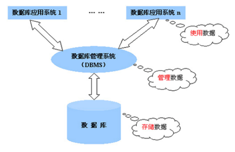
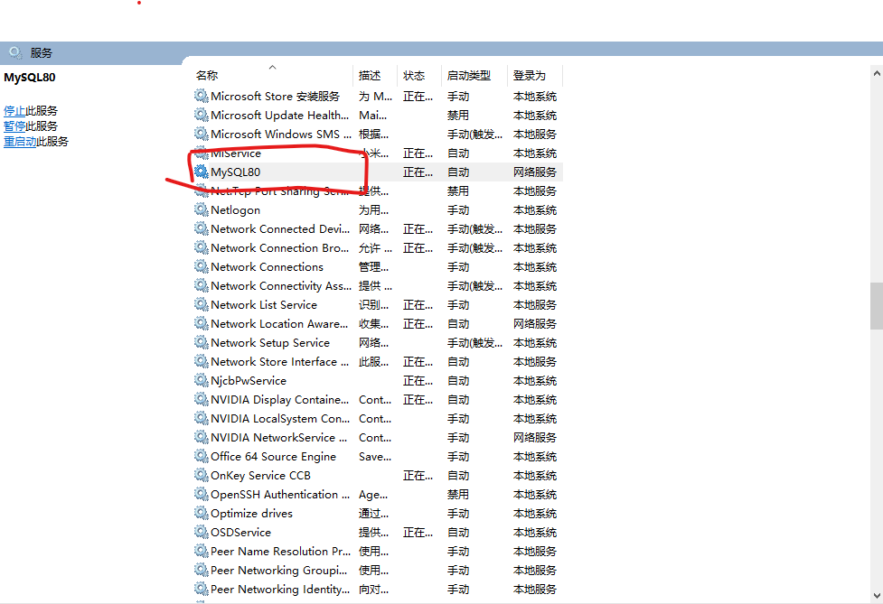

## 六、常用第三方中间件

### 4、时间插件

实现功能：生成一时间和随机为文件名的文件

#### 安装

```
npm i time-stamp
```

#### 案例代码

```
const timeStamp=require("time-stamp");
console.log(timeStamp("YYYYMMDDHHmmss"));
console.log(timeStamp("YY"));
//生成订单编号，日期+时间+随机数8位
console.log(timeStamp("YYYYMMDDHHmmss")+Math.random().toString().substring(2,10));
```

### 5、唯一字符串生成

#### 安装

```
npm i uuid
```

#### 案例代码（服务器端使用）

```
const {v4:uuid4}=require("uuid");
const {v1:uuid1}=require("uuid")
console.log(uuid4());
console.log(uuid1());
```

### 6、模板引擎（EJS）

EJS是一套简单的模板语言。它是服务器端转义语言，是由标签和 JavaScript 语法语法组成。

#### 安装

```
npm  i ejs 
```

#### 使用步骤

(1)下载  ejs 
(2)在项目中设置ejs模板引擎 

```
app.set("view engine",“ejs"); 
```

(3)在项目根目录下创建views文件夹 ，也可以通过set方法设置根目录

```
app.set(‘views’,“./view”); 
```

(4)在views文件夹下创建模板文件，注意必须以 .ejs为后缀名

#### EJS服务器端渲染语法

```
res.render( '模板名称' ,[ data ])
```

**参数：**

(1)参数1为模板名称不需要添加后缀，会自动寻找对应名称的.ejs文件  
(2)参数2为可选参数，向模板中传递的数据，必须是一个JSON格式对象

#### EJS页面标签语法

##### 输出变量语法：

```
<%=变量名 %>
<%-变量名 %>
```

##### 分支语法：

```
<% if( 条件 ){%>
	条件代码
<% }else{ %>   
	条件代码
 <% } %>
```

##### 循环语法：

```
<% for(let i=0;i<数组.length;i++){ %>  
	循环代码
<% }%>
```

##### 包含文件语法：

```
<%- include('公共文件路径')  %>
```

#### 服务器端代码

```
const express=require("express");
const ejs=require("ejs");
const app=express();

app.engine("html",ejs.renderFile);//如果需要将其它类型的文件设置支持EJS语法。
app.set("views","./aa");//设置页面所在的路径，默认是views.
app.set("view engine","html");//参数一是固定键名，参数二是文件的页面后缀名。

app.get("/",(req,res)=>{
    //如果你的页面再默认的views文件夹下，那么render的第一个参数可以直接是文件名,render的第二个参数可以向页面传参。
   //res.render("index",{username:"admin"})//渲染EJS页面的。 

   let user=[{"userid":4,"username":"rypy87","pwd":"123456","isadmin":"1"},{"userid":5,"username":"admin6","pwd":"123456","isadmin":"1"},{"userid":7,"username":"admin8","pwd":"1123123123123123","isadmin":"1"},{"userid":8,"username":"admin9","pwd":"123345345345","isadmin":"0"},{"userid":12,"username":"admin","pwd":"123456","isadmin":"1"},{"userid":14,"username":"rypy","pwd":"123456","isadmin":"1"},{"userid":22,"username":"admin10","pwd":"123456","isadmin":"1"},{"userid":23,"username":"admin111","pwd":"123","isadmin":"0"},{"userid":24,"username":"admin1234","pwd":"123dgdfgd","isadmin":"1"},{"userid":28,"username":"admin1","pwd":"123456","isadmin":"1"},{"userid":30,"username":"rypy87","pwd":"13213123","isadmin":"0"},{"userid":32,"username":"admin7","pwd":"123","isadmin":"0"}];
   res.render("index",{userlist:user,username:"admin"})//渲染EJS页面的。
});

app.listen(1234);
```

#### 页面代码

```
<!-- EJS模板引擎支持全部的HTML标签和样式 -->
<span style="color: aqua;"><h1>我是EJS页面。</h1></span>

<% 
    //此标签可以书写任意es语法
    let age=20;
    console.log("ssssss");//EJS页面中的console是服务器端输出。
    function f(){
        return `<span style="color:red;">我是函数返回值</span>`;
    }
    //EJS的标签可以跟HTML标签嵌套使用。
%>
<%# 带=的形式是可以输出js变量/调用函数，不可以转义HTML标签 %>
<%# 带-的形式是可以输出js变量/调用函数，可以转义HTML标签 %>
<%# 带#的形式是EJS语法中的注释，不会再转义后的html中显示。 %>
<%=age%>
<br>
<%=f()%>
<br>
<%-f()%>
<br>
<%=(age>20?"已成年":"未成年")%>
<br>
<%# EJS中的if判断语句 %>
<%  if(age>18){  %>
     已成年   
<%    }else{ %>
     未成年   
<%    }%>
%>
<br>
<% let arr =[1,2,3,5,6,7];%>
<%# EJS中的循环语句 %>
<% for(let item of arr){ %>
    <%=item%>
    <br>
<% } %>


<%# 获取服务器端数据 %>
 用户名：<%=username%> 

<table border="1">
    <thead>
        <th>用户ID</th>
        <th>用户名</th>
        <th>密码</th>
        <th>权限</th>
        <th>操作</th>
    </thead>
    <tbody>
        <% for(let item of userlist){ %>
            <tr>
                <td><%=item.userid%></td>
                <td><%=item.username%></td>
                <td><%=item.pwd%></td>
                <td><%=item.isadmin==="1"?"管理员":"普通用户"%></td>
            </tr>
        <% } %>
    </tbody>
</table>
<%# 引入其它EJS页面　%>
<%- include("footer.ejs") %>

<%# 如果要再页面输出<   %    %>
<%% 
%%>
```

## 七、Express脚手架

express-generator（又称为脚手架工具） 可以快速创建一个应用的骨架。

### 1、使用步骤

#### 1.1 安装express-generator工具

```sh
 npm i express-generator -g
```

#### 1.2 使用脚手架初始化项目

```sh
express --view=ejs 项目名
```

	--view=ejs : 你的项目使用ejs模板引擎

#### 1.3 进入目录, 安装所有需要的模块

```
cd 项目包名 
npm i
```

#### 1.4 启动项目

```
npm  start   
完整的命令叫 ： npm run start
注意：start是一个特殊的名字。所以只这个start可以省略run。
```

注：上面的命令是在package.json文件内配置的script属性。

#### 1.5 浏览器访问

### 2、目录和文件介绍

app.js : 入口文件

views: 模板文件夹

routes:子路由存放文件夹

public:静态资源存放文件夹

bin: www：启动的文件

package.json：项目的配置文件

## 八、KOA框架

Koa 是一个新的 web 框架，由 Express 幕后的原班人马打造， 致力于成为 web 应用和 API 开发领域中的一个更小、更富有表现力、更健壮的基石。 通过利用 async 函数，Koa 帮你丢弃回调函数，并有力地增强错误处理。 Koa 并没有捆绑任何中间件， 而是提供了一套优雅的方法，帮助您快速而愉快地编写服务端应用程序。

### 1 使用步骤

#### 1.1 安装koa-generator工具：

```js
npm i koa-generator -g 
```

#### 1.2 使用脚手架初始化项目

 ```
koa2  项目包名 
 ```

说明：如果需要ejs模板, 在koa2 后 加 -e参数：

```
koa2 -e --ejs  项目包名 
```

#### 1.3 进入目录, 安装所有需要的模块

```
cd 项目包名 
npm i
```

#### 1.4 启动项目

```
npm start
```

#### 1.5 浏览器访问

### 2. 目录及文件介绍

(1)bin/www：启动文件
(2)app.js：入口文件
(3)public：静态资源文件夹
(4)routes：模块化路由文件夹
(5)views：模板文件夹
(6)package.json：项目配置文件

### koa与express区别：

(1)koa 把 express 中内置的 router、view 等功能都移除了，使得框架本身更轻量化。
(2)Koa使用了Promise配合异步函数, 来组合各种中间件使用, 做到真正的异步代码同步化使用。

## 前后端数据交互总结

| 请求方法 | 编码格式                            | 前端要传输的数据格式                                    | 后端如何获取                          | 应用场景 |
| -------- | ----------------------------------- | ------------------------------------------------------- | ------------------------------------- | -------- |
| GET      | url地址后面（querystring）          | url?key1=value1&key2=value2                             | 不需要中间件:req.query                | 获取数据 |
| POST     | applicaion/x-www-form-urlencoded    | form-data: key1=value1&key2=value2                      | express.urlencoded( { extend:true } ) | 提交数据 |
| POST     | applicaion/json（只能通过ajax）     | request-payload:  '{ "key1":"value1","key2":"value2" }' | express.json()                        |          |
| POST     | mutilpart/form-data（可以使用表单） | 文件流                                                  |                                       | 文件上传 |
| DELETE   | 同post                              |                                                         |                                       | 删除数据 |
| PUT      | 同post                              |                                                         |                                       | 更新数据 |

# 第10-11讲 Mysql数据库

## 一、数据库简介

### 概念

数据库（database，DB）是指，按照数据结构来组织、存储和管理数据的仓库。

### 数据库管理系统：

数据库管理系统（Database  Management System，简称DBMS）：用来对数据进行管理的软件，它是数据库系统的核心组成部分。

#### 主要功能：

数据定义、数据操纵、数据库运行管理、数据库的建立和维护功能、数据通信。

**常见的数据模型有：**网状、关系、层次、面向对象。



### 常见的数据库管理软件（DBMS）

#### Oracle 

Oracle Database，又称Oracle RDBMS、Oracle。是甲骨文公司的一款关系数据库管理系统。
特性：处理速度快，非常快，安全级别高，支持快闪以及完美的恢复（即硬件坏了，也可以恢复到故障发前一秒），可以做到30s内故障转移，网格控制，和数据仓库方面也非常强大。

#### MySQL

MySQL是一个小型关系型数据库管理系统，被广泛地应用在中小型企业级应用。也是甲骨文公司的一款产品。
**特性：**开放源码、高度非过程化、面向集合的操作方式、以一种语法结构提供多种使用方式。 

#### MS SQLServer

SQLserver数据库是微软公司发布的一款RMDBS数据库，也就是关系型数据库系统。
**特性：**图形化用户界面、客户服务器体系结构、丰富的编程接口工具、与Windows NT完成集成、具有很好的伸缩性，

#### DB2

DB2是一系列混合数据管理产品，提供完整的 AI 支持的能力，旨在帮助您管理本地、私有云和公共云环境中的结构化和非结构化数据。目前隶属于IBM公司
**特性：**无限的扩展能力、应用透明、持续的高可用性。

### 数据库存储数据的方式：

取决于数据库的类型(数据模型不同)，并按照一定的规则进行存储。

#### 1、根据数据类型分类：


#### 2、根据特定属性分类

与 Excel 中数据的组织结构比较类似。每个 Excel 中，数据的组织结构分别为工作簿、工作表、数据行、列这 4 大部分组成 。

| **学生编号** | **姓名** | **年龄** | **性别** | **省份** | **学历** | **老师编号** |
| ------------ | -------- | -------- | -------- | -------- | -------- | ------------ |
| 2019001      | 小黄     | 19       | 男       | 北京     | 本科     | 10003        |
| 2019002      | 王明     | 18       | 男       | 天津     | 专科     | 10001        |
| 2019003      | 大江     | 19       | 女       | 河北     | 本科     | 10006        |

| **老师编号** | **姓名** | **性别** | **年龄** |
| ------------ | -------- | -------- | -------- |
| 10001        | 彭老师   | 男       | 32       |
| 10003        | 张老师   | 女       | 25       |
| 10006        | 李老师   | 男       | 28       |

## 二、Mysql数据库的安装

安装步骤详见安装文档

mysql 官网：https://www.mysql.com/
mysql下载地址 https://dev.mysql.com/downloads/mysql/

**查看Mysql服务**



命令行登录Mysql

```
mysql -u root -p
```

查看本地数据库命令

```
show database
```

## 三、数据库可视化工具

操作数据库最古老的方式为cmd。这种方式操作相对比较繁琐、命令无法保存。数据库可视化工具可以使开发者更高效的操作数据库。常用的数据库可视化工具Navicat,功能相对比较强大，支持数据库比较多。

安装步骤见安装文档。

### Navicat的使用

#### 1、建立数据库连接

#### 2、查看本地数据库

#### 3、数据库的创建

##### 图形化界面

##### 命令

```
create database 数据库名
```

#### 4、数据库表的创建

##### 图形化界面


##### 数据表组成部分：

(1)表名
(2)列信息，又叫字段名
(3)字段数据类型、
(4)字段约束信息

###### 表：

一般情况下，每个项目都对应独立的数据库。不同的数据，存储到数据库的不同表中。

###### 行：

表中的行，代表每一条具体的数据。

###### 字段

表示具有同一特征的字段。

###### 表与表的联系：

有些表之间会以某个字段产生关系。

##### mysql常见数据类型：

###### 数值型

| **名字**     | **类型**                                                     |
| ------------ | ------------------------------------------------------------ |
| 位置整型     | **bit(M)**                                                   |
| 极小整型     | **tinyint(M)**                                               |
| 短整型       | **smallint(M)**                                              |
| 中整型       | **mediumint(M)**                                             |
| 整型         | **int(M)**、**integer(M)**                                   |
| 长整型       | **bigint(M)**                                                |
| 单精度浮点型 | **float(M,D)**                                               |
| 双精度浮点型 | **double(M,D)**                                              |
| 高精度浮点型 | **numeric(M,D)**、**decimal(M,D)**、**dec(M,D)**、**fixed(M,D)** |
| 布尔类型     | **bool**、**boolean**                                        |

###### 字符串型

| **类型**         | **说明**       |
| ---------------- | -------------- |
| **char(M)**      | 定长字符       |
| **varchar(M)**   | 变长字符       |
| **binary(M)**    | 定长二进制字节 |
| **varbinary(M)** | 变长二进制字节 |
| **tinyblob**     | 二进制字符串   |
| **blob(M)**      | 二进制字符串   |
| **mediumblob**   | 二进制字符串   |
| **longblob**     | 二进制字符串   |
| **tinytext**     | 字符串         |
| **text(M)**      | 字符串         |
| **mediumtext**   | 字符串         |
| **longtext**     | 字符串         |

###### 日期时间类型

| **类型**           | **占用字节** |
| ------------------ | ------------ |
| **datetime(fsp)**  | 8            |
| **Date**           | 3            |
| **timestamp(fsp)** | 4            |
| **year**           | 1            |
| **time(fsp)**      | 3            |

###### 枚举类型

| **类型**                 | **描述**                                                     |
| ------------------------ | ------------------------------------------------------------ |
| **ENUM(‘v1’, ‘v1’……..)** | 一个ENUM列最多可以包含65535个不同元素。单个ENUM元素长度255，且索引是从1开始。 |
| **SET(‘v1’, ‘v1’……..)**  | 一个SET列最多可以包含64个不同元素。单个SET元素长度255，且索引是从1开始。 |

###### JSON类型

JSON类型的数据可以是NULL或者是JSON格式的数据，其它格式会报错。且默认值只可以设置为NULL。

##### 