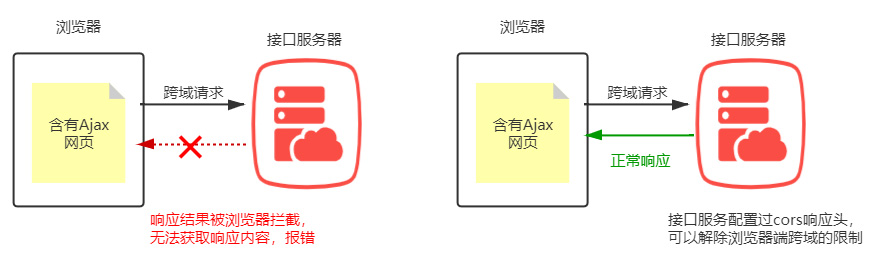

## 七、Node操作Mysql

### Query语句执行增删改查

#### 执行增加语句

```
conn.query(sqla,(err,result)=>{
    if(err){
        if(err.message.includes("Duplicate entry")){
            console.log("用户名已存在！");
        }else{
            console.log("添加用户名错误，请联系管理员");
        }
    }
    else{
        if(result.affectedRows>0){
            console.log("添加成功！");
        }else{
            console.log("添加失败！");
        }
    }
});
//?,sql语句中的占位符，可以动态获取sql语句中的参数。使用占位符传递参数可以防止sql注入式攻击。注：？与参数的值一定要一一对应。
let sqlb=`insert users(username,pwd) value(?,?)`;
conn.query(sqlb,["pwdd","adminb"],(err,result)=>{
    if(err){
        if(err.message.includes("Duplicate entry")){
            console.log("用户名已存在！");
        }else{
            console.log("添加用户名错误，请联系管理员");
        }
    }
    else{
        if(result.affectedRows>0){
            console.log("添加成功！");
        }else{
            console.log("添加失败！");
        }
    }
});
```

#### 执行修改语句

```
let user={
    userid:"c4a7f191-f4cb-11eb-9044-e45e3790a8ac",
    pwd:"12344"
}

let user2={
    userid:"c4a7f191-f4cb-11eb-9044-e45e3790a8ac",
    pwd:"123445555",
    isadmin:"1"
}
//将对象转换为字符串 pwd='123123',isadmin=0
// function getStrByObj(obj) {
//     let str="";
//     for (let [key,value] of Object.entries(obj)){
//         if(!checkData(value)){
//             if(typeof value==="string"){
//                 str+=`${key}='${value}',`;
//             }else{
//                 str+=`${key}=${value},`;
//             }
//         }
//     }
//     return str.substring(0,str.length-1);
// }
// function checkData(param) {
//     return param===undefined||param===null||param===""||param==="undefined"||param==="null"?true:false;
// }
// let userid=user2.userid;
// delete user2.userid;
// let sqlu=`update users set ${getStrByObj(user2)} where userid=?`;

// conn.query(sqlu,[userid],(err,result)=>{
//     if(err)console.log("修改失败，请联系管理员！");
//     else{
//         if(result.affectedRows>0){
//             console.log("修改成功！");
//         }else{
//             console.log("修改失败，暂无该ID数据！");
//         }
//     }
// });
```

#### 执行删除语句

```
let sqld=`delete from users where userid=?`;
conn.query(sqld,["d0c90d09-f4cc-11eb-9044-e45e3790a8ac"],(err,result)=>{
    if(err)console.log("删除数据失败，请联系管理员");
    else{
        if(result.affectedRows>0){
            console.log("删除成功！");
        }else{
            console.log("删除失败，暂无该ID数据！");
        }
    }
});
```

#### 执行查询语句

```
let sql=`select * from users`;
let sql1=`select * from users where username=? and pwd=?`;
conn.query(sql1,["admin","1234567"],(err,result)=>{
    if(err)console.log("查询数据库失败，请联系管理员！");
    else{
        if(result.length>0){
            console.log(result);
        }else{
            console.log("暂无用户数据");
        }
    }
});
```

# 第12讲 项目综合知识

依托于纯JSON格式开发的项目，就是接口开发的项目，一般前后端分离项目都是接口开发类项目。接口的开发必须遵循RESTful API规范。RESTful规范，是目前一种比较流行的互联网软件设计规范。

## 一、前后端分离模式

**前端**：通过接口获取JSON格式的数据，并将数据渲染到前端页面。

**后端：**通过接口获取前端请求需求，并通过一些中间件将前端传输数据进行加工优化，将数据传入业务层逻辑，业务层逻辑结合业务与数据，获取需求所需数据，并从数据库中将数据取出，通过业务逻辑层将数据加工为JSON格式的数据，通过路由返回给前端。

## 二、RESTful API规范

### 优点

有利于开发者在进行独立开发或协作开发更标准，以达到行业的统一。它结构清晰、符合标准、易于理解、扩展方便，越来越多的开发者遵守这种规范。

### 常用的方法规范：

(1) HEAD:SELECT只获取某个资源的头部信息
(2) GET：SELECT 获取资源 
(3)POST：CREATE 创建资源 
(4)PUT：UPDATE 更新资源 
(5)DELETE：DELETE 删除资源

**案例**

GET http://www.ujiuye.com/api/user # 获取列表
POST http://www.ujiuye.com/api/user # 创建用户
PUT http://www.ujiuye.com/api/user/{id} # 修改用户信息
DELETE http://www.ujiuye.com/api/user/{id} # 删除用户信息

### 接口路由的定义

以学生表为例

| 功能         | 方法   | 路由            | 参数                                                       |
| ------------ | ------ | --------------- | ---------------------------------------------------------- |
| 增加一个学生 | POST   | /student        | req.body  : 姓名和学号...                                  |
| 删除一个学生 | DELETE | /student?id=111 | req.query  : id  学生的id去删                              |
| 更新一个学生 | PUT    | /student?id=111 | req.query获取id，还要获取更新的新数据 req.body :姓名和学号 |
| 查一个 学生  | GET    | /student?id=111 | req.query获取id                                            |
| 查一个 学生  | GET    | /student/111    | req.params                                                 |
| 查一组 学生  | GET    | /students?      | req.query  :  page,size  ( 页码和长度 )                    |

### JSON格式数据的定义

#### 增加数据

以学生为例

```
{
	status:200,//状态码
	msg:'添加成功',
	result:返回添加成功的那个id
}
```

#### 删除数据

以学生为例

```
{
  	status:200,//状态码
  	msg:'删除成功',
}
```

#### 修改数据

以学生为例

```
{
  	status:200,//状态码
  	msg:'更新成功',
}
```

#### 查询数据

以学生为例

##### 单条数据

```
{
  	status:200,//状态码
  	msg:'更新成功',
  	result:{
  		username:'',
  		age:20
  	}
}
```

##### 多条数据

```
{
  	status:200,//状态码
  	msg:'更新成功',
  	result:{
  		data:[//具体的学生列表
  			{},
  			{}
  		],
  		page:'',//当前页码
  		pageTotal:'',//总页码
  		rows:'',//总条数
  	}
}
```

### 遵循RESTful，进行接口开发

**以学生表为例**

(1)使用express脚手架生成接口项目  express --view=ejs myapp 

(2)进入myapp目录 安装依赖 npm install 

(3)创建student.js和teacher.js到routes目录中 

(4)定义模块化路由代码 

(5)在入口文件app.js中引入路由 

(6)启动项目

#### userRouter.js

```
/*
 * @Author: RYPY
 * @Date: 2021-07-30 09:09:49
 * @LastEditors: RYPY
 * @LastEditTime: 2021-08-04 17:34:09
 */
const express=require("express");
const um=require("../model/userModel");
const router=express.Router();

//注册用户路由
router.post("/reguest",async(req,res)=>{
    res.send(await um.reguest(req.body));
});
//登录路由
router.post("/login",async(req,res)=>{
    res.send(await um.login(req.body));
});
//获取用户列表路由
router.post("/userlist",async(req,res)=>{
    res.send(await um.getUserlistByPageAndSearch(req.body));
});
//批量删除
/**
 * 参数格式：{"useridArr":[77,78,79,80,81]}
*/
router.post("/deluser",async(req,res)=>{
    res.send(await um.delUserByid(req.body));
});

//修改用户路由
router.post("/upuser",async(req,res)=>{
    res.send(await um.updateUser(req.body));
});

//测试响应
router.get("/text",(req,res)=>{
    res.send({code:200,msg:"测试接口get",...req.query});
});
router.post("/text",(req,res)=>{
    res.send({code:200,msg:"测试接口",...req.body});
});

module.exports=router;
```

#### app.js

```
const express=require("express");
const cors=require("cors");
const app=express();
app.use(cors());
app.use(express.urlencoded({extended:true}));
app.use(express.json());

app.use("/",require("./router/userRouter"));

app.all("/*",(req,res)=>{
    res.send({code:201,msg:"您所访问的资源去了火星！"});
});
app.use((err,req,res,next)=>{
    if(err)console.log(err);
    res.send({code:500,msg:"服务器压力山大，请稍后再试"});
});
app.listen(1234);
```

### 接口说明书

以本地为例

#### 服务器地址：

http://localhost:3000

#### 功能

添加学生信息

#### 接口地址

/student

#### 请求方式

POST

#### 参数

{username，age}

| 参数名   | 值           | 是否必传 |
| -------- | ------------ | -------- |
| username | 字符串：小明 | 是       |
| age      | 数字：20     | 否       |

#### 访问接口

http://localhost:3000/student

#### 响应结果

```
{
	status:200,//状态码
	msg:'添加成功',//结果消息
	result:123,//返回添加成功的那个数据id
}
```

**常用百款数据接口**：https://www.juhe.cn/docs

## 三、原生AJax技术

Ajax技术，全称是Asynchronous Javascript And XML（异步 JavaScript 和 XML），本质上是，浏览器利用 XMLHttpRequest 对象和服务器进行数据交互的方式。ajax是典型的异步形式。

### Ajax请求与传统请求的区别

#### 传统请求


#### ajax请求


### 优势和作用：

ajax异步发送请求，代替浏览器向服务器端发送请求，ajax请求的返回值，可以实现局部渲染。

### 应用场景

#### 表单验证

用户名检测，当注册用户时，通过 ajax 的形式，动态检测用户名是否合法。


#### 分页功能

网络中数据是非常庞大的，可以使用分页功能提高用户体验。常见的效果有点击页码、上滑加载更多等，发送 ajax，根据页码值动态更新数据列表的数据。


### Ajax原理

#### XMLHttpRequest对象

创建XMLHttpRequest对象实例

##### 语法：

```
let xhr =new XMLHttpRequest();
```

#### 方法

##### open()方法

建立连接请求。

###### 语法

```
xhr.open(method,url,async)
```

###### 参数

method，设置请求方式，常见取值get / post/delete / put。
url，配置请求地址
async，设置是否异步处理，取值是boolean类型。

##### send()方法

发送请求到服务器。

###### 语法：

```
xhr.send(参数)
```

**注：**参数仅用于POST传递参数

#### 属性

##### readyState

ajax的状态值

###### 语法

```
xhr.readyState
```

###### 常见取值

​	 (1)0：请求未初始化，还没有调用open

​	 (2)1：请求已经建立，但是还没有发送send 

​	 (3)2：请求已经发送  已经执行了send

​	 (4)3：请求正在处理中，通常响应中已经有部分数据可以用了 

​	 (5)4：响应已经完成，可以获取并使用服务器的响应 

##### status

服务器端返回状态码

###### 语法：

```
xhr.status
```

###### 常见状态码

200，304，404，500

##### responseText 

服务器端响应内容

###### 语法

```
xhr.responseText
```

#### 事件

当请求被发送到服务器时，每当 readyState 改变，就会触发 onreadystatechange 事件。

##### 语法：

```
xhr.onreadystatechange  = callback
```

### 原生Ajax实现步骤

(1)创建XMLHttpRequest对象实例
(2)使用open方法建立连接
(3)使用send方法发送请求 
(4)判断ajax状态和状态码
(5)获取数据处理数据

**完整案例**

```
		//1、创建XMLHttpRequest实例
        let xhr=new XMLHttpRequest();
        //2、建立连接
        xhr.open("get","http://localhost:1234/text");
        //3、发送请求
        xhr.send();//注：发送请求的时候可以传递参数。
        //4、获取响应
        xhr.onreadystatechange=()=>{
            if(xhr.status===200&&xhr.readyState===4){
                console.log(xhr.responseText);
            }
        }
```

###  ajax的get和post传参

#### GET传参

**语法**

```
xhr.open('get', 'http://www.api.com?username=admin&password=123456')
```

**案例**

```
let xhr=new XMLHttpRequest();
        xhr.open("get","http://localhost:1234/text?username=admin");
        xhr.send();//注：send方法只能发送post请求参数。
        xhr.onreadystatechange=()=>{
            if(xhr.status===200&&xhr.readyState===4){
                console.log(xhr.responseText);
            }
        }
```

#### POST传参

使用setRequestHeader设置响应头，并传递对应的post参数

**语法1**

```
xhr.setRequestHeader('Content-Type', 'application/x-www-form-urlencoded') 
xhr.send('username=admin&password=123456');
```

**语法2**

```
xhr.setRequestHeader('Content-Type', 'application/json') 
let data = {username:'admin',password:'123456'}
xhr.send(JSON.stringify(data))
```

**案例**

```
let xhr=new XMLHttpRequest();
        xhr.open("post","http://localhost:1234/text");
        //xhr.setRequestHeader("Content-Type","application/x-www-form-urlencoded");
        //xhr.send("page=1&a=2");//注：send方法只能发送post请求参数。且必须要设置响应头部。
        xhr.setRequestHeader("Content-Type","application/json");
        xhr.send(JSON.stringify({page:1}));
        xhr.onreadystatechange=()=>{
            if(xhr.status===200&&xhr.readyState===4){
                console.log(xhr.responseText);
            }
        }
```

## 四、JQuery的Ajax

JQuery的Ajax也是基于XMLHttpRequest封装的。

JQuery的浏览器引入地址https://code.jquery.com/jquery-3.6.0.min.js

### GET方式

**语法：**

```
$.get(URL,[data],callback)
```

注：JQuery的get方式可以单独传递参数，但参数有大小的限制

**案例：**

```
         let data=await $.get("http://localhost:1234/text?username=admin");
            let data=await $.get("http://localhost:1234/text",{username:"adminss"});
            let data=await $.get({
                url:"http://localhost:1234/text",
                data:{username:"admindddd"},
                success:(texts)=>{
                    console.log(texts);   
                },
                error:(err)=>{
                    console.log(err);
                },
                xhrFields:{withCredentials:true}//设置当前请求是否可以携带cookie,withCredentials属性的默认值是false.
            });
```

### POST方式

**语法：**

```
$.post(URL,data,callback)
```

**案例：**

```
            let data=await $.post("http://localhost:1234/text",{username:"admin"});    
            let data=await $.post({
                url:"http://localhost:1234/text",
                data:{username:"admin111"},
                success:(rtest)=>{
                    console.log(rtest);
                },
                error:(err)=>{
                    console.log(err);
                },
                xhrFields:{withCredentials:true}
            });
```

### ajax方式

即可以返送get请求方式，也可以发送post方式

**语法：**

```
$.ajax({
   type: '',//请求方式,默认值是get
   url: '', //请求地址 
   data: { },//传递的参数,
   success: (res)=> { },//成功的回调 
   error: (err)=> { },//失败的回调
   xhrFields: {withCredentials: true}//设置是否需要携带cookie
});
```

**案例**

```
            let data=await $.ajax({
               url:"http://localhost:1234/text",
               method:"post",
               data:{username:"adminddd"},
               success:()=>{},
               error:()=>{},
               xhrFields:{withCredentials:true}
            });
            console.log(data);
```

## 五、跨域

### 跨域种类


### 跨域错误


### CORS解决跨域



#### 服务器端配置cors

##### Access-Control-Allow-Origin

设置接口的请求地址。默认*

**语法：**

```
 res.header('Access-Control-Allow-Origin', '*');
```

##### Access-Control-Allow-Methods

设置接收的请求方式，默认只有GET和POST

**语法：**

```
res.header('Access-Control-Allow-Methods', '*');
```

#### CORS中间件

**使用步骤**

1、下载中间件

```
 npm i cors 
```

2、引入中间件

3、绑定中间件

```
const cors = require('cors')
//使用cors中间件，允许跨域
app.use(cors());
```

### JSONP解决跨域

JSONP，即JSON + padding，把服务端传过来的json数据 padding（填充）在html页面标签中。JSPNP模式只能发送get请求。

```
<button id="btn1">按钮</button>
    <script>
        function jsonp() {
            let script = document.createElement('script');
            script.type = 'text/javascript';
            // 传参并指定回调执行函数为backFn
            script.src = 'http://localhost:1234/?uid=100&callback=callbackFn';
            document.head.appendChild(script);
        }
        // 回调执行函数
        function callbackFn(res) {
            alert(JSON.stringify(res));
        }
        document.getElementById('btn1').addEventListener('click',()=>{
            jsonp();
        });
</script>
```

## 六、Promise与Ajax

使用promise封装ajax

```
function HttpAjax({ url = '', type = 'get', data = {} }) {
            return new Promise((resolve, reject)=>{
                $.ajax({
                    url,
                    type,//对象的简写形式
                    data,
                    success(res) {
                        resolve([null, res])
                    },
                    error(err) {
                        resolve([err])
                    }
                })
            })
        }
```

## 七、Promise、Ajax与async综合

使用封装的ajax发送请求

```
$('button').click( async()=>{
            let result = await Http({
                url: './students.json'
            });
            console.log( result,'我是结果' );
 });
```


