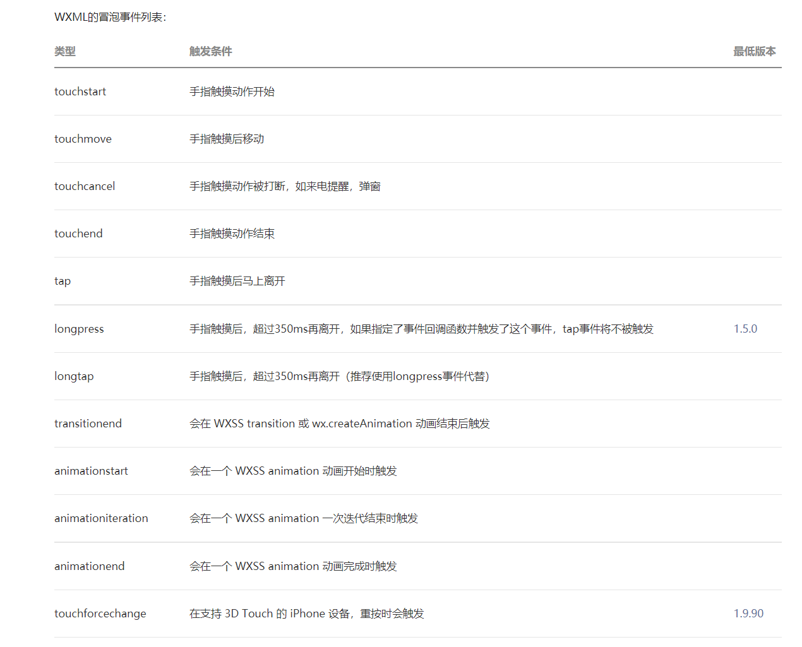

```js
/*
*@ WXML语法、WXSS样式、事件系统、WXS脚本语法、视图容器组件
*@ 朱银娟
*@ time 2021/09/23
**/
```

# 一、知识点回顾

```

```

# 二、作业讲解

```

```

# 三、基础组件

## text

相当于span

```html
<!-- 

  text  文本容器
    user-select 是否被选中
    space  显示连续空格
          ensp  中文字符空格的一半
          emsp  中文字符空格
          nbsp   是根据字符空格
    decode  是否解码
注意事项
    tip: decode可以解析的有 &nbsp; &lt; &gt; &amp; &apos; &ensp; &emsp;
    tip: 各个操作系统的空格标准并不一致。
    tip:text 组件内只支持 text 嵌套。
    tip: 除了文本节点以外的其他节点都无法长按选中。
    bug: 基础库版本低于 2.1.0 时， text 组件内嵌的 text style 设置可能

 -->
<view>
  <text class="box" user-select="{{true}}" space="ensp">文本 文本文本文本文本文本文本</text>
</view>
<view>
  <text class="box" user-select="{{true}}" space="emsp">文本 文本文本文本文本文本文本</text>
</view>
<view>
  <text class="box" user-select="{{true}}" space="nbsp" decode="{{true}}">文本 文本文本文本文本文本文本&lt;</text>
</view>

```

## image

```html
<!--pages/cart/cart.wxml-->
<!-- <text>pages/cart/cart.wxml</text> -->
<!-- <image src="../../imgs/cart.png"></image>
<image src="https:.com/image_search/src=http%3A%2F%2Fww1.sinaimg.cn%2Fmw690%2F006Bdrd" binderror="error" bindload="load"></image> -->
<!-- 

    image  图片容器
    src  图片资源地址  可以是网络图片，也可以是本地图片
    bindload
      图片加载成功
    binderror
      图片加载失败
    lazy-load
      懒加载
 -->
<image src="../../imgs/cart.png" lazy-load="{{true}}" bindload="load1"></image>

```

# 四、视图层概述 

(1)框架的视图层由 WXML 与 WXSS 编写，由组件来进行展示。
(2)将逻辑层的数据反映成视图，同时将视图层的事件发送给逻辑层。
(3)WXML(WeiXin Markup language) 用于描述页面的结构。
(4)WXS(WeiXin Script) 是小程序的一套脚本语言，结合 WXML，可以构建出页面的结构。
(5)WXSS(WeiXin Style Sheet) 用于描述页面的样式。
(6)组件(Component)是视图的基本组成单元。

# 五、WXML语法

## 1.wxml概述及作用 

概述：

```
WXML（WeiXin Markup Language）是框架设计的一套标签语言，结合基础组件、事件系统，可以构建出页面的结构。
```

## 2.数据绑定  

```html
<!-- 数据绑定 -->
<!-- 简单的数据绑定 -->
<view>{{msg}}</view>
<!-- 属性绑定  vue: :class="变量名"  小程序 class="{{变量名}}" -->
<view class="{{className}}"></view>
<!-- 三目运算  表达式的值?true的执行结果:false的执行结果 -->

<view>{{store>60?"及格":"不及格"}}</view>
<!-- 字符串运算 -->

<view>{{1+"1"}}</view>
<!-- 算术运算 -->
<view>{{store + 10}}</view>
<!-- 关键字运算   true/false  hidden 隐藏  true不显示  false显示 -->
<view hidden="{{false}}">是否显示</view>
<!-- 动态class  如果store大于60  class为box -->

<view class="{{store>45?'box':''}}"></view>
<!-- 路径运算 如何显示数组或者对象中的数据 -->
<view>{{arr[3]}}</view>
<view>{{userInfo.name}}</view>
```

## 3.列表渲染

```html

<!-- 列表渲染  
    vue    v-for = "(a,b) in 循环体"  :key=""

    小程序中  wx:for = "{{循环体}}"   wx:key="属性名"


    1. 默认数组的当前项的下标变量名默认为 index，数组当前项的变量名默认为 item

    2.修改默认值
      wx:for-index= "新名"
      wx:for-item="新名"
    注意事项：修改默认值之后 原先的index和item将失效
 -->

 <!-- 数组循环 -->
 <view wx:for="{{arr}}" wx:key="*this">{{index}}----{{item}}</view>
 <!-- 对象循环 -->
 <view wx:for="{{userInfo}}">{{index}}----{{item}}</view>
  <!-- 对象循环 -->
  <view wx:for="{{userInfo}}" wx:for-index="key" wx:for-item="value">{{key}}----{{value}}</view>

  <!-- key值 表示item的唯一性
      wx:key的取值
        *this
          当你的item是string或者是number类型,并且这个itme是唯一不变的，*this指的就是item本身
        唯一属性
          当你的item不是string或者number的时候，去找item中的唯一属性，这个唯一属性必须是不重复的number类型或者string

          
     注意：如不提供 wx:key，会报一个 warning， 如果明确知道该列表是静态，或者不必关注其顺序，可以选择忽略。  
   -->

   <view wx:for="{{arr1}}" wx:key="id">
    {{item.name}}----{{item.age}}----{{item.sex}}
   </view>

<!-- block   相当于template 标签 接受控制属性  wx:for  wx:if-->
<!-- 1234 -->
<view wx:for="{{arr}}">{{item}}</view>
<view>
    <block wx:for="{{arr}}">
      {{item}}
    </block>
</view>

<!-- 注意事项 不要在双花括号和双引号之间加空格 -->

<view wx:for="{{ [4,5,6,7] }}">{{item}}</view>
```

## 4.条件渲染  

```html
<text>pages/my/my.wxml</text>

<!-- 小程序中：
    wx:if
    wx:else
    wx:elif
 -->


<!-- <view wx:if="{{num>70}}">显示</view>
<view wx:else>不显示</view> -->

<view  wx:if="{{num>80}}">优秀</view>
<view wx:elif="{{num>60}}">中等</view>
<view wx:else>不及格</view>

<!-- Wx:if hidden 他们两个有什么区别  参考v-show和v-if
    hidden 改变css的样式 display为none或者block
    wx:if  是惰性加载  控制dom元素是否加载
    如果频繁显示隐藏 hidden


    因为 wx:if 之中的模板也可能包含数据绑定，所以当 wx:if 的条件值切换时，框架有一个局部渲染的过程，因为它会确保条件块在切换时销毁或重新渲染。

  同时 wx:if 也是惰性的，如果在初始渲染条件为 false，框架什么也不做，在条件第一次变成真的时候才开始局部渲染。

  相比之下，hidden 就简单的多，组件始终会被渲染，只是简单的控制显示与隐藏。

  一般来说，wx:if 有更高的切换消耗而 hidden 有更高的初始渲染消耗。因此，如果需要频繁切换的情景下，用 hidden 更好，如果在运行时条件不大可能改变则 wx:if 较好。
 -->

 <view hidden="{{true}}">hidden</view>
 <view wx:if="{{false}}">wx:if</view>
 <!-- block标签 -->
 <block wx:if="{{true}}">显示</block>
```

## 5.模板 

```html
封装wxml结构  成为模板template
如何定义模板
	<template name=""></template>
如何使用模板
	<template is=""></template>
如何传参
	data
如何引用	
	import/include
```

## 6.引用 

```
 import 引入目标文件中的template区域
include 可以将目标文件除了 <template/> <wxs/> 外的整个代码引入，相当于是拷贝到 include 位置
```

案例

tem.wxml定义

```html
<template name="mytem1">
<!-- name age -->
  <view class="box">姓名:{{name}}</view>
  <view>年龄:{{age}}</view>
  <image src="/imgs/cart.png"></image>
</template>

<template name="mytem2">
    <!-- obj = {name：,age：} -->

    <view>姓名{{obj.name}}</view>
    <view>年龄{{obj.age}}</view>
</template>

<view>普通的标签</view>
```

my.wxml使用

```html
 <!-- 引入 -->
 <import src="../../common/tem"></import>
 <!-- 使用 -->
 <template is="mytem1" data="{{name:'ls',age:60}}"></template>

<template is="mytem2" data="{{obj:{name:'ww',age:18} }}"></template>

<template is="mytem2" data="{{obj}}"></template>

<!-- import 引入目标文件中的template区域
     include 可以将目标文件除了 <template/> <wxs/> 外的整个代码引入，相当于是拷贝到 include 位置
 -->
<include src="../../common/tem"></include>
```

cart.wxml使用

```html
<!-- 引入 -->
<import src="../../common/tem"></import>
 <!-- 使用 -->
 <template is="mytem1" data="{{name:a,age:b}}" ></template>

```

# 六、WXSS样式

WXSS (WeiXin Style Sheets)是一套样式语言，用于描述 WXML 的组件样式。

WXSS 用来决定 WXML 的组件应该怎么显示。

为了适应广大的前端开发者，WXSS 具有 CSS 大部分特性。同时为了更适合开发微信小程序，WXSS 对 CSS 进行了扩充以及修改。

## 1.新特性 

```html
与 CSS 相比，WXSS 扩展的特性有：

- 尺寸单位
	rpx 自适应单位 把设备都分成750份
	
	设计稿上的大小/设计稿的宽度 = 实际布局的大小 / 设备的宽度

	设计稿是750px   在设计稿上量出10px的一个宽度
	
	苹果6的设备  375px
		实际布局是多少
        10px / 750px = ?5px / 375px
        10px / 750 = ?10rpx / 750rpx
	苹果6p的设备 414px
		实际布局是多少
		10px / 750px = ?5.52px / 414px
		10px / 750px = ?10rpx / 750rpx 
		
	设计稿是640px  在设计稿上量出10px的宽度
		10px / 640px = ? / 750rpx
	
- 样式导入
	@import 路径
	@import "../../common/reset.wxss";
```

## 2.全局样式/局部样式 

```
全局样式  app.wxss
局部样式  page.wxss

局部样式的优先级比全局样式高
```

# 七、事件系统

## 1.概念

```
视图层到逻辑层的通讯方法
```

## 2.事件绑定

```
bind+事件类型 = "事件函数名"

catch+事件类型 = "事件函数名"

注意：事件函数名不允许带（）
```

## 3.传参接参

```
id
	传参 id="123"
	接参  e.target.id   e.currentTarget.id
data-* 自定义字符串
	传参  data-index="ls"
	接受参数  e.target.dataset.index  e.currentTarget.dataset.index
```

## 4.事件分类

```
冒泡事件：
	也称为为公共事件，会向父节点进行传递
非冒泡事件
	也称为私有事件，不会向父节点进行传递
```



## 5.事件对象

```
event事件对象
	接参
	事件类型
	时间戳等等
```

**总结：**

```html
bind和catch有什么区别?
	bind 允许冒泡
	catch 阻止冒泡
target和currentTarget有什么区别?
   target  事件源组件上的参数
   currentTarget 当前触发事件绑定组件上的参数
```

# 八、WXS脚本语法

## 1.WXS脚本概述 

WXS（WeiXin Script）是小程序的一套脚本语言，结合 WXML，可以构建出页面的结构。

wxs存在的意义就是充当compute/filter这类功能。vue中有watch(侦听属性)，angular中有filter(过滤器)。其核心作用都是用来避免重复地在模板内写过长的表达式。

**支持的数据类型：**

```
`WXS` 语言目前共有以下8种数据类型：
- `number` 数值类型
- `string` 字符串类型
- `boolean` 布尔类型
- `object` 对象类型
- `function` 函数类型
- `array` 数组类型
- `date` 日期类型
- `regexp` 正则
```

## 2.WXS 模块

### 2.1遵循CommonJS` 模块化规范

```
定义变量只能用var关键字
暴露接口只能使用commonjs规范
并且不能简写
```

### 2.2<wxs> 标签

```html
<!-- 定义 -->
<wxs module="mywxs1">
// 不能使用es6的语法 let const export default
  var text="这是wxs标签脚本区域"
  function fn1(){
    return "这是fn1函数"
  }
  // 暴露接口只能使用commonjs规范  不能简写
  module.exports = {
    text:text,
    fn1:fn1
  }

</wxs>

<wxs module="mywxs2">
  var text = "wxs脚本2"
  function toFix(price){
    return  price.toFixed(2)
  } 
  module.exports = {
    text:text,
    toFix:toFix
  }

</wxs>
```

```html
<!--使用 -->
<view>{{mywxs1.text}}</view>
<view>{{mywxs1.fn1()}}</view>

<!-- 使用 -->
<view>{{mywxs2.text}}</view>
<view>{{mywxs2.toFix(price)}}</view>
```

### 2.3wxs 文件

1.新建wxs文件

```
var text1 = "文本"

function toFix(price){
  return price.toFixed(3)
}

module.exports = {
  text1:text1,
  toFix:toFix
}
```

2.在wxml中

```js
<!-- 使用 -->

<wxs src="../../common/global.wxs" module="wxs3"></wxs>
<view>{{wxs3.text1}}</view>
<view>{{wxs3.toFix(price)}}</view>
```

### 2.4反转字符串示例

abc--cba

[a,b,c]  reverse  [c b a] -----"cba"

```js
function Reverse(str){
  return str.split("").reverse().join("")
}
```

**注意事项：**

```
(1)WXS 不依赖于运行时的基础库版本，可以在所有版本的小程序中运行。
(2)WXS 与 JavaScript 是不同的语言，有自己的语法，并不和 JavaScript 一致,在 `wxs`中不要使用高级的`JS`语法;
(3)WXS 的运行环境和其他 JavaScript 代码是隔离的，WXS 中不能调用其他 JavaScript 文件中定义的函数，也不能调用小程序提供的API。
(4)WXS 函数不能作为组件的事件回调。
(5)由于运行环境的差异，在 iOS 设备上小程序内的 WXS 会比 JavaScript 代码快 2 ~ 20 倍。在 android 设备上二者运行效率无差异。
```

# 九、视图容器组件

## 1.swiper/swiper-item滑块视图容器 

```html
<!-- 
  swiper   滑块视图容器
    默认大小 宽度100% 宽度150px
  swiper-item
  image 默认大小  320*240
 -->

 <swiper
   indicator-dots="{{true}}" 是否显示指示点
   indicator-color="black"  指示点的颜色
   indicator-active-color="#f00"  当前轮播图所对应的指示点颜色
   autoplay="{{true}}" 是否自动播放
   interval="1000"   轮播图间隔时间
   circular="{{true}}"  是否采用衔接播放
   vertical="{{false}}"  是否采用纵向播放
   next-margin="100"    前边距
   previous-margin="100"  后边距
   current="1"  当前滑块的下标
   bindchange="change"  当轮播图发生改变的时候  会触发change事件
 >
    <swiper-item>
      <image src="../../imgs/1.jpg"></image>
    </swiper-item>
    <swiper-item>
      <image src="../../imgs/2.jpg"></image>
    </swiper-item>
    <swiper-item>
      <image src="../../imgs/3.jpg"></image>
    </swiper-item>
 </swiper>

```

封装指示点

wxml

```html
<view class="box">
  <!-- 图片区域 -->
  <swiper
  autoplay="{{true}}"
  bindchange="change"
>
    <swiper-item wx:for="{{arr}}" wx:key="*this">
      <image src="{{item}}"></image>
    </swiper-item>
</swiper>

<!-- 指示点 -->
<view class="dots">
  <text wx:for="{{arr}}" wx:key="*this" class="{{currentIndex==index?'active':''}}"></text>
</view>
</view>

```

wxss

```css
image{
  width: 100%;
  height: 100%;
}
.box{
  position: relative;
}
.dots{
  width: 100%;
  text-align: center;
  position: absolute;
  bottom: 0;
  left: 0;
}
.dots text{
  width: 30rpx;
  height: 15rpx;
  display: inline-block;
  background-color: #cccccc;
  margin: 0rpx 5rpx;
}
.dots .active{
  background-color: red;
}
```

js

```js
Page({
  data: {
      arr:[
        "../../imgs/1.jpg",
        "../../imgs/2.jpg",
        "../../imgs/3.jpg",
      ],
      currentIndex:0
  },
  change(e){
    let index = e.detail.current
    this.setData({
      currentIndex:index
    })
  },
})
```

## 2.scroll-view可滚动视图区域 

横向滚动

```
<!-- 设置横向的独立滚动区域 
    1.子组件的要超过父组件的宽度
    2.设置父组件强制不换行   white-space: nowrap;
    3.给父组件添加scroll-x属性
-->
<scroll-view class="box" scroll-x="{{true}}">
    <view>推荐1</view>
    <view>推荐2</view>
    <view>推荐3</view>
    <view>推荐4</view>
    <view>推荐5</view>
    <view>推荐6</view>
    <view>推荐7</view>
    <view>推荐8</view>
    <view>推荐9</view>
    <view>推荐10</view>
</scroll-view>

```

纵向滚动

```js

<!-- 纵向的独立滚动区域 
    1.子组件的总高度要超过父组件
    2.给父组件添加scroll-y属性
-->

<view class="wrap">
  <scroll-view class="left" scroll-y="{{true}}">
    <view>推荐1</view>
    <view>推荐2</view>
    <view>推荐3</view>
    <view>推荐4</view>
    <view>推荐5</view>
    <view>推荐6</view>
    <view>推荐7</view>
    <view>推荐8</view>
    <view>推荐9</view>
    <view>推荐10</view>
  </scroll-view>
  <scroll-view class="right"></scroll-view>

</view>
```

css样式

```css
.box{
  white-space: nowrap;
}
.box view{
  display: inline-block;
  padding: 10rpx;
}
.left{
  width: 30%;
  height: 1000rpx;
  background-color: red;
  float: left;
}
.right{
  width: 70%;
  height: 1000rpx;
  background-color: green;
  float: left;
}

.left view{
  width: 100%;
  height: 150rpx;
  text-align: center;
  line-height: 150rpx;
  background-color: #cccccc;
}
.left view:nth-of-type(2n){
  background-color: hotpink;
}
```

## 3.原生组件native-component

小程序中的部分组件是由客户端创建的原生组件，这些组件有：

- [`camera`](https://developers.weixin.qq.com/miniprogram/dev/component/camera.html)
- [`canvas`](https://developers.weixin.qq.com/miniprogram/dev/component/canvas.html)
- [`input`](https://developers.weixin.qq.com/miniprogram/dev/component/input.html)（仅在focus时表现为原生组件）
- [`live-player`](https://developers.weixin.qq.com/miniprogram/dev/component/live-player.html)
- [`live-pusher`](https://developers.weixin.qq.com/miniprogram/dev/component/live-pusher.html)
- [`map`](https://developers.weixin.qq.com/miniprogram/dev/component/map.html)
- [`textarea`](https://developers.weixin.qq.com/miniprogram/dev/component/textarea.html)
- [`video`](https://developers.weixin.qq.com/miniprogram/dev/component/video.html)

原生组件的层级是最高的，所以页面中的其他组件无论设置z-index为多少，都无法盖在原生组件上。

后插入的原生组件可以覆盖之前的原生组件。

==cover-view 与 cover-image==

为了解决原生组件层级最高的限制。小程序专门提供了 [`cover-view`](https://developers.weixin.qq.com/miniprogram/dev/component/cover-view.html) 和 [`cover-image`](https://developers.weixin.qq.com/miniprogram/dev/component/cover-image.html) 组件，可以覆盖在**部分**原生组件上面。这两个组件也是原生组件，但是使用限制与其他原生组件有所不同

## 4.cover-view覆盖在原生组件之上的文本视图

```html
<text>pages/nativeCom/nativeCom.wxml</text>
<map scale="{{num}}">
    <cover-view class="add" bindtap="_add">+</cover-view >
    <view class="desc" bindtap="_desc">-</view>
</map>
```

## 5.cover-image覆盖在原生组件之上的图片视图

```html

<map scale="{{num}}">
   <cover-image src="../../imgs/1.jpg" class="add" bindtap="_add"></cover-image>
</map>
```

# 九、课后作业

```
1基础作业
(1)当天课上代码至少练习1遍
(2)根据模板语法、事件传参、data数据 更新进行案例编写，完成基础作业2封装加载更多模板案例效果

	加载更多  loadMore
    正在加载  loading
    没有更多数据了 noData

```


