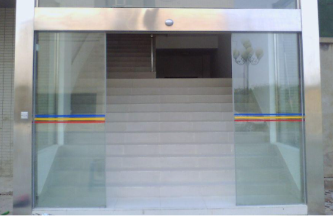

#  CSS 浮动

## 学习目标

- 掌握浮动属性的应用

- 熟悉浮动元素的基础特性

- 能够说出浮动产生的的问题

- 掌握清浮动的方法

  

## 概述

网页中有很多布局效果，标准流normal flow没有办法完成，使用可以利用浮动改变元素默认的排列方式，举例说明（如网页中横向排列的模块或者一左一右排列的模块）

## 浮动的概念

浮动可以使元素【脱离文档流】，【按照指定方向排列】，直到遇到父元素的边界或另一个浮动元素【停止】

## 浮动属性

- float

  -  left 左浮动
  -  right 右浮动
  -  float:none 不浮动(默认值)

  

## 浮动的基本特性

 **特性：** 

1.找父盒子左右边界  遇到浮动元素or行内类型元素立即停止浮动

2.浮动打破标准流状态，形成浮动流 

 3.浮动元素提升层次 压盖标准流元素  但是不压盖文本流

  4.浮动影响单向向下传递 

   5. 任何类型的元素只要添加浮动属性就不用区分元素类型，变成了并排的块可以设置任何盒模型

      属性

​        

## 【综合案例】京东首屏画块

## 浮动的问题（为什么要清浮动）

- 子元素浮动导致父元素高度塌陷(height为0)（本质原因: 浏览器不计算浮动元素高度）
- 影响之后元素的布局

## 清浮动的方法

解决问题即清除动的方法

- 父元素固定高度法

  - 描述：给浮动元素的父元素固定高度 
  - 缺点：不够灵活
  - 代码演示

- 父元素overflow方法

  - 描述：给父元素加 overflow 属性，overflow 为 visible 以外的其它值时可以帮助实现 

  - overflow:hidden/scroll/auto 触发BFC盒子的形成 

  - 缺点：可能会隐藏内容或触发不需要的滚动条

    

- 额外标签法

  - 描述：在浮动元素的最后加一个空块元素，此元素本身不浮动，且添加样式clear:both;

  - clear属性说明

    - 作用：清除浮动
    - 取值

      - left
        both
        right
      - 提示通常使用both,
    
    ==清除浮动影响的是只能块类型！！==
  - 缺点：代码冗余，影响代码可读性

- 伪元素:after

  - 描述：给浮动标签的父标签添加 
    
    ```css
    .clearfix:after{
         content:"";
         display:block;
         clear:both;
    }
    
    ```
    
  - 优点：内容适应性强，不会在结构上产生冗余代码，可多次重复使用
  
    

## 伪元素

伪元素作用：用css代码创造元素

语法如下:

```css
 通过伪元素创造两个元素 插入到box盒子的内部 

 伪元素都是行内类型！！！
        
        E::after { 创造一个元素插入到E元素的所有内容之后

            content:"";//写伪元素文本


        }
        E::before {创造一个元素插入到E元素的所有内容之前
           content:"";
        }
           
      
```

>== **注意：**==
>
>​           1. 一个元素只能有两个伪元素 ::aftet  ::before
>
>​           2. 伪元素必须要写content属性
>
>​           3. 可以写::   也可以写:
>
>​           :  针对低版本浏览器(ie8及其以下)
>
>​           :: 针对是高版本的浏览器
>
>

==适用场合：与数据没有太大关联 起到修饰作用的小盒子！！==


## 浮动特性应用实例


### 1、实例图文绕排

- 总结：浮动脱离文档流不脱离文本流

  


### 2、两列自适应

- 实现要点：单列定宽，单列自适应
- 浮动实现

  - 说明：
    左侧列固定，左侧浮动，右侧列使用margin-left预留位置。
    右侧列固定同理
  - 代码演示

## 滑动门

### 概述：

为了使各种特殊形状的背景使各种特殊形状的背景能够自由拉伸滑动，以适应元素内部的文本内容，出现了CSS滑动门技术。 最常见于各种导航栏的滑动门

### 实例预览

https://weixin.qq.com/


### 形象图示



### 实现要点

- 特殊背景拼合
- 内容自适应
  - 浮动
  - 行内块


## CSS 精灵图技术

学习目标

- 能够说出什么是CSS精灵
- 掌握CSS精灵在实际示案例中的应用

### 概述

css精灵英文叫法 css sprites，通常被解释为“CSS 图像拼合”或“CSS 贴图定位”；其实就
是把网页中一些背景图片整合到一张图片文件中，再利用 CSS “background-image”，
“background- repeat”，“background-position”的组合进行背景定位，background-position 精确的定位出背景图片的位置

==利用背景属性background-image插入图片，然后在利用background-position移动图片的位置，达到我想显示的图片部分显示在固定宽高的盒子里==

### 精灵图的原理

### 实现步骤：

(1)通常要限定容器大小

(2)图片拼合.png . webp

(3)背景定位bgp

### 优缺点

#### 优点

（1）减少网页的 http 请求，从而大大的提高页面的加载速度；
（2）图片命名上的困扰；
（3）更换风格方便。

#### 缺点

#### （２）需要测量。

	- 应用场景：适用于一般小图片（如小图标，小背景），不适合大背景大布局背景。
	- 图像拼合小工具汇总分享
