# css3

## 学习目标

- 能够说出CSS3有哪些新特性
- 能够利用新增的选择器解决实际布局问题
- 熟练使用CSS圆角、投影、box-sizing、background-size属性
- 掌握iconfont的原理及应用

## CSS3概述

CSS3是CSS（层叠样式表）技术的升级版本，最新的 CSS 标准。
在CSS2.1的基础上增加了很多强大的新功能，以帮助开发人员解决一些问题，例如圆角、多背景、透明度、阴影等。
CSS2.1是单一的规范，而CSS3被划分成几个模块组，每个模块组都有自己的规范。这样的好处是整个CSS3的规范发布不会因为某部分而影响其他模块的推进。

CSS3按模块化进行了全新设计，主要的 CSS3 模块：包括:选择器、框模型、背景和边框、文本效果、2D/3D 转换、动画、多列布局、用户界面

### 现状

现代浏览器已经实现了相当多的 CSS3 属性,CSS3将完全向后兼容

#### 浏览器的私有前缀

概述：CSS3的浏览器私有属性前缀是一些浏览器生产商经常使用的一种方式，用于对新属性的提前支持，暗示该CSS属性或规则尚未成为W3C标准的一部分。当一个属性成为标准，并且被Firefox、Chrome等浏览器的最新版普遍兼容的时候我们可以去掉前缀。

各个主流浏览器的私有前缀

- WebKit内核	-webkit-	   Chrome、Safari
- Gecko内核	-moz-	      火狐浏览器
- Presto内核	 -o-	           Opera(欧朋)
- Trident内核	 -ms-         	IE
- 内核		 私有前缀	          浏览器

```
自动前缀插件：autoprefixer
```

## CSS3新增选择器

学习目标

- 能够说出CSS3新增了哪些选择器
- 能够使用新增的选择器解决实际布局问题

### 属性选择器

通过元素属性和属性值选择元素

#### CSS3新增的属性选择器

- [attr^=value] 选择指定属性名且属性值【以value开头】的每个元素
- [attr=value] 选择带有指定属性名且属性值【以value开头】所有元素
- [attr*=value] 选择指定属性名且属性值【包含value】的每个元素

- 典型应用场景

#### 兼容性

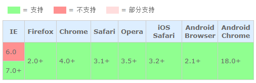

#### 常用属性选择器列表：

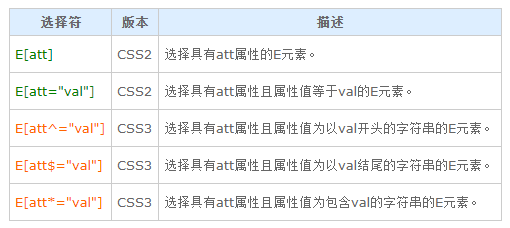


### 结构性伪类选择器

通过结构关系选择元素

#### css3 新增的结构性伪类

:last-child 选择器：匹配属于其父元素的最后一个子元素的每个元素
:nth-child( n ) 选择器：匹配属于其父元素的第 n 个子元素
:nth-last-child( n ) 选择器：匹配属于其元素的倒数第 n 个子元素的每个元素

:first-of-type(n) 选择其父元素的特定类型的首个子元素的每个元素
:last-of-type(n) 选择其父元素的特定类型的最后一个子元素的每个元素。
:nth-of-type(n)：选择器匹配属于父元素的特定类型的第n 个子元素。
:nth-last-of-type(n)：选择器匹配属于父元素的特定类型的倒数第 n 个子元素的每个元素

- 说明

   - n 可以是数字、关键词或公式
   - 关键词

     - odd奇数，even偶数  3n  5n 

   - 2n 偶数   2n+1奇数   -n+i 前i个    后i个   max指的是元素总个数   max-i+n+1


#### 总结child一组与of-type一组的区别

- nth-child强调结构 关系，优先确定是否是父元素的子元素，在其中找第几个
- nth-of-type强调类型，选择父元素中指定类型中的第几个

#### 兼容性

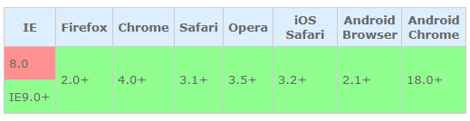

#### 


### 状态伪类选择器

### css3新增

- :enabled 

  -  作用：选择器匹配每个已启用的元素
  -  主要适用于：表单元素
- :disabled 

  - 作用：选择器匹配每个被禁用的元素
  - 主要适用于：表单元素
- :checked 

  - 作用：选择器匹配每个已被选中的 input 元素
  - 适用于：只用于单选按钮和复选框
- ：focus 
- ::placeholder

#### 兼容性

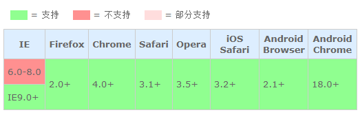

#### 常用元素状态、用户行为伪类列表


### 伪元素选择器

#### :before 

- 作用：在元素内部最开始位置生成内容
- 语法：元素:before{content:"内容"}

#### :after

- 作用：在元素内部最后位置生成内容
- 语法：元素:before{content:"内容"}

```
注：必须定义content属性
```

##### before与after 兼容性

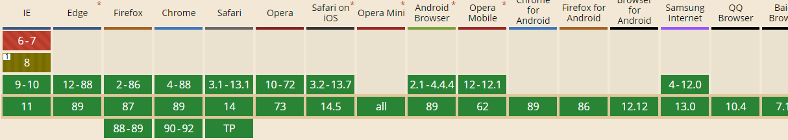

#### ::placeholder

- 设置对象文字占位符的样式

- ::placeholder 伪元素用于控制表单输入框占位符的外观，它允许开发者/设计师改变文字占位符的样式，默认的文字占位符为浅灰色。

注：

```
除了Firefox是 ::[prefix]placeholder，其他浏览器都是使用 ::[prefix]input-placeholder
```

```css
<input type="text" placeholder="占位符" />

input::-webkit-input-placeholder {
	color: #999;
}
input:-ms-input-placeholder { // IE10+
	color: #999;
}
input:-moz-placeholder { // Firefox4-18
	color: #999;
}
input::-moz-placeholder { // Firefox19+
	color: #999;
}
```

##### 兼容

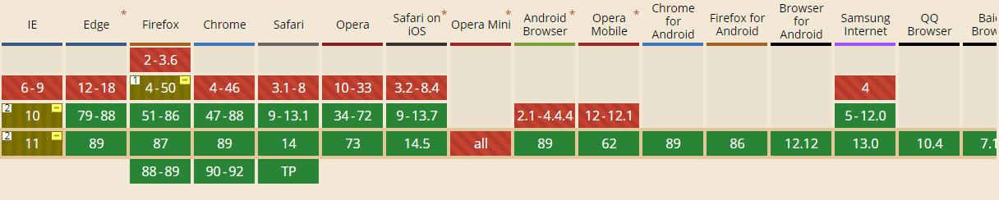

- IE10-11、firefox低版本支持前缀写法

## CSS3 字体

#### 字体阴影

- 作用：为文字添加阴影。每个阴影值由元素在X和Y方向的偏移量、模糊半径和颜色值组成 
- 语法

  - “空格”隔开
  - 添加多个阴影，阴影值之间用==逗号==隔开

```css
             text-shadow:h-shadow水平阴影尺寸  v-shadow垂直阴影尺寸  blur模糊距离  color 颜色 ;

             左上 -1px -1px , 右下  1px 1px 
            
             左上2px蓝色阴影 右下2px红色阴影
             text-shadow: 1px 1px 2px red,-1px -1px 2px skyblue;
```


#### 自定义字体

使用以前 CSS 的版本，网页设计师不得不使用用户计算机上已经安装的字体。

使用 **CSS3**，网页设计师可以使用的任何字体，只需简单的将字体文件包含在网站中，它会自动下载给需要的用户。

##### 语法

```
//定义字体
@font-face{
	font-family：“myfont”;
	src:url("字体格式1.woff") format("woff")..
	
}
```

```
应用字体：
.box{
	font-family:"myfont";
}
```

说明：format表示字体格式

兼容

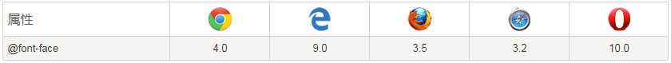

##### 说明：

- ie6-8只支持.eot字体
- Internet Explorer 9+, Firefox, Chrome, Safari, 和 Opera 支持 WOFF (Web Open Font Format) 字体.
- Firefox, Chrome, Safari, 和 Opera 支持 .ttf(True Type字体)和.otf(OpenType)字体字体类型）。
- Chrome, Safari 和 Opera 也支持 SVG 字体

==如果设计人员给大家了一个字体文件，那大家可以去以下这个网站转换为兼容性的网络字体声明代码和文件==

https://www.fontke.com/tool/fontface/ 生成字体文件的网址

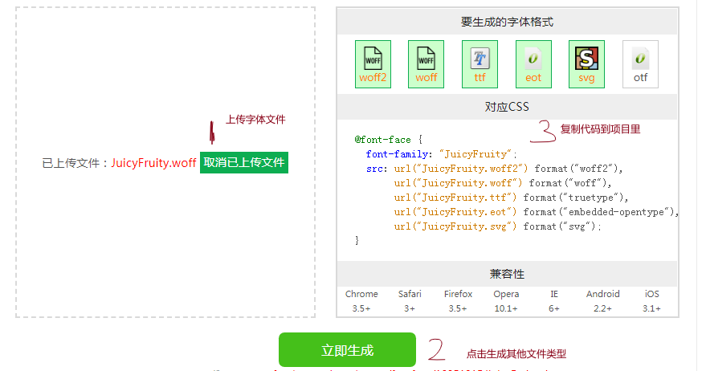

##### 应用：

iconfont 添加至项目的使用

- 登录iconfont

  

- 挑选图标加入购物车

  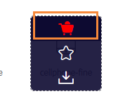

- 将图标添加至项目

  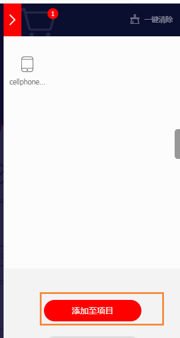

  - 还未创建项目需要在此创建项目

    

- 进入我的项目——选择fontclass方式，查看在线链接

  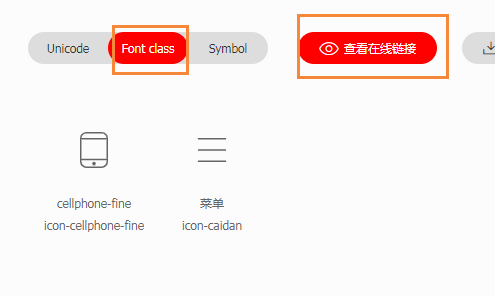

- 将文件引入项目

  ```
  <link href="http://at.alicdn.com/t/font_2474231_62smug0rv6r.css">
  ```

- 挑选类名并应用于页面

  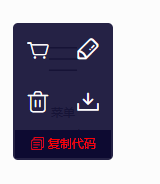

  ```
  <i class="iconfont icon-caidan">
  ```

## CSS3 边框

通过 CSS3，能够创建圆角边框，向矩形添加阴影替代之前的切背景图处理

#### 圆角

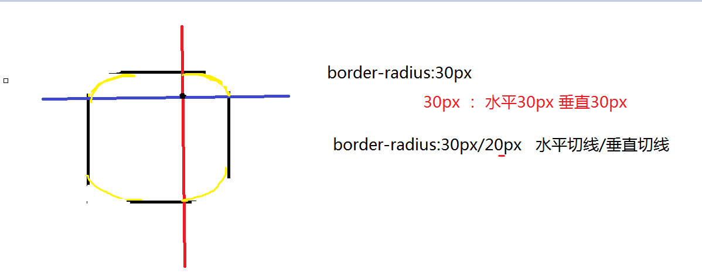

- 作用：为元素添加圆角边框

- 单个边定义

  - 语法： border-*-radius
  - border-top-left-radius	定义了左上角的弧度
    border-top-right-radius	定义了右上角的弧度
    border-bottom-right-radius	定义了右下角的弧度
    border-bottom-left-radius	定义了左下角的弧度

- 常用取值

  - px
  - 百分比

    - 分别相对于宽高计算（非内容）

  - 不允许负值

- 简写border-radius

  - 语法

    - 空格 隔开

      - 四个值：左上角、右上角、右下角、左下角 水平和垂直半径
        三个值：左上角、右上角和左下角，右下角
        两个值：左上角与右下角、右上角与左下角
        一个值： 四个圆角值相同

    - "\"隔开 	

      - 水平半径（1-4）/垂直半径（1-4）
      - 规则同上

- 兼容 

  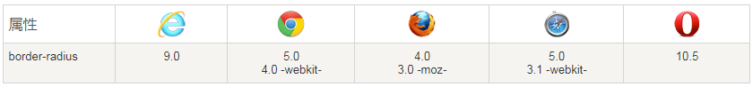

#### 阴影

- 作用：为设置一个或多个阴影

- 语法

  - box-shadow: 阴影水平偏移值 垂直偏移 模糊值 外延值 阴影颜色 内阴影;
  - 空格隔开

- 取值说明

  - none 无阴影
  - 第1个长度值用来设置对象的阴影水平偏移值。可以为负值
  - 第2个长度值用来设置对象的阴影垂直偏移值。可以为负值
  - 第3个长度值用来设置对象的阴影模糊值。不允许负值
  - 第4个长度值用来设置对象的阴影外延值。不允许负值
  - color 	可选。阴影的颜色
  - inset：设置对象的阴影类型为内阴影

- 多个阴影

  - 用逗号分隔
  - 第一个阴影在最上面,书写顺序越靠前，越靠上

- 兼容 

  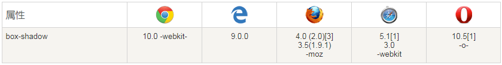

## CSS3 背景

概述：CSS3更新增了新的背景属性，提供对元素背景更灵活的控制

#### 多个背景图像

CSS3中可以通过background-image给元素上添加多个背景图像

语法

- 不同的背景图像和图像用【逗号】隔开，也可以给不同的图片设置多个不同的属性

  - 单独定义

  ```
  #example1 { 
  background-image: url(img_flwr.gif), url(paper.gif); 
  background-position: right bottom, left top; 
  background-repeat: no-repeat, repeat; 
  }
  ```

  - 简写

    ```
    #example1 {
    background: url(img_flwr.gif) right bottom no-repeat, url(paper.gif) left top repeat;
    }
    ```


- 注意强调:如果设置的多重背景图之间存在着交集（即存在着重叠关系），
  前面的背景图会覆盖在后面的背景图之上

#### background-origin背景图像的起始点

- 作用：指定背景图像的起始点
- 取值

  - padding-box：从padding区域（含padding）开始显示背景图像。（默认值）
  - border-box：从border区域（含border）开始显示背景图像。
  - content-box：从content区域开始显示背景图像。


#### background-clip背景裁剪区域

- 作用：指定背景绘制区域
- 取值

  - border-box 默认值。背景绘制在边框方框内（剪切成边框方框）。
  - padding-box	背景绘制在衬距方框内（剪切成衬距方框）。
  - content-box	背景绘制在内容方框内（剪切成内容方框）


#### background-size背景图像的大小

- 概述：CSS3以前，背景图像大小由图像的实际大小决定，CSS3中可以指定背景图片，让我们重新在不同的环境中指定背景图片的大小
- 取值

  - px：用长度值指定背景图像大小。不允许负值。
  - 百分比：用百分比指定背景图像大小。不允许负值。
  - auto：背景图像的真实大小。
  - cover：将背景图像等比缩放到完全覆盖容器，背景图像有可能超出容器。
  - contain：将背景图像等比缩放到宽度或高度与容器的宽度或高度相等，背景图像始终被包含在容器内。

- 注意:当属性值为百分比时，参照背景图像的background-origin区域大小进行换算（而不是包含块大小）

- 合并简写

  - 语法：

    - background： image  position / size repeat origin clip  color
    - 空格，斜杠

  - 注意强调：背景颜色只能有一个


### 兼容

表格中的数字表示支持该属性的第一个浏览器版本号。

紧跟在 -webkit-, -ms- 或 -moz- 前的数字为支持该前缀属性的第一个浏览器版本号。

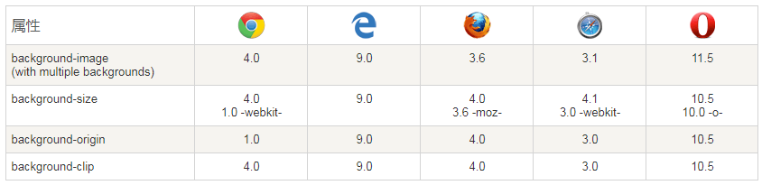

## CSS3 渐变

CSS3 渐变（gradients）可以让你在两个或多个指定的颜色之间显示平稳的过渡。
CSS3 定义了两种类型的渐变（gradients）通过background-image指定：
线性渐变（Linear Gradients）- 向下/向上/向左/向右/对角方向。
径向渐变（Radial Gradients）- 由它们的中心定义。

#### 线性渐变

linear-gradient() 函数用于创建一个表示两种或多种颜色线性渐变的图片。

创建一个线性渐变，需要指定两种颜色，还可以实现不同方向（指定为一个角度）的渐变效果，如果不指定方向，默认从上到下渐变。

- 语法

  - background: linear-gradient(direction, color-stop1, color-stop2, ...);

- 代码演示

  - 均匀分布的渐变
  - 定义颜色节点的渐变
  - 渐变重复 

    - 语法：repeating-linear-gradient( ) 

  - 渐变方向

    - 使用起始位置关键字
    - 使用角度 

- 多重渐变

  - 语法：逗号隔开
  - 提示：书写顺序越靠前显示越靠上
  - 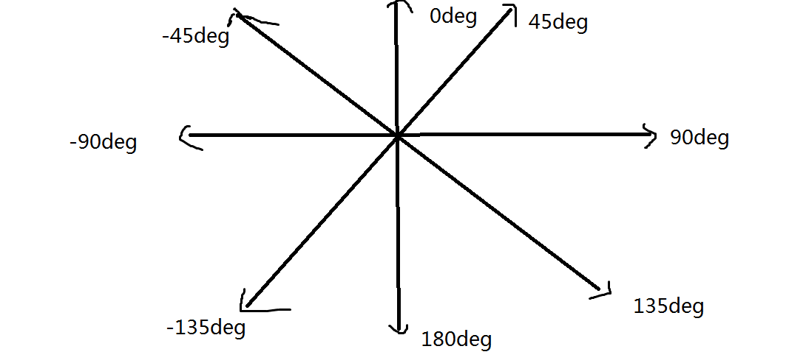
  
  ```css
   .linear {
               /* 渐变就是背景图  bgi
               linear-gradient(方向, 颜色1 停止位置,颜色2 停止位置....)
               方向: 度数 45deg 90deg  /方位值 to left /to right 从左到右的渐变
               */
               background-image: linear-gradient(45deg,#000 50%,#fff 80%);
               background-size: 30px 30px;
             
  
           }
  ```
  
  

#### 径向渐变

radial-gradient() 函数用径向渐变创建 "图像"。

- ```css
  
               标准写法 
               radial-gradient(形状  大小  渐变中心位置 ,颜色1 停止位置,颜色2 停止位置....)
  
               形状: circle 圆形 / ellipse 椭圆(默认值)
               取决于你的盒子 背景盒子是正方形 那么无论写哪个值都是圆的 
               背景盒子是长方形 那么写circle ellipse 就是椭圆
  
               大小： 最近边closest-side   最远边 farthest-side  最近角closest-corner  最远角
               farthest-corner （默认值）
  
               渐变中心位置 at xpx ypx / at x% y% 
  
               注意: 属性值之间的,写的位置！！！！
  
              重复径向渐变:
              background-image: radial-gradient(circle farthest-corner at center center, #fff 10%,#000 50%); 
  ```

- 

- 兼容

  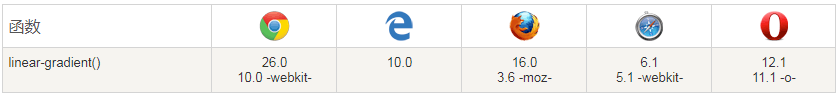

  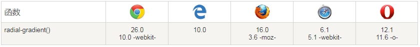

## CSS3 用户界面


#### box-sizing 

- 作用：规定盒子组成模式

- 取值

  content-box：定义宽高不包括宽度和高度
  border-box：字义宽高包括宽度和高度

兼容性：

## 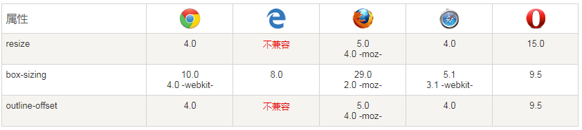多列布局

CSS3 支持在布局中建立列（column）的数量，以及内容如何在列之间流动（flow）、列之间的间距（gap）大小，以及列的分隔线（column rules）。

### column-width属性

- 作用：规定栏目的宽度。
- 取值

  - number	指定栏目宽度。
  - auto	自动，由其他属性决定列数，如 "column-count"。

### column-count属性

- 作用：规定元素应该被划分的列数
- 取值

  - auto	 由其他属性决定列数，比如 "column-width"。
  - number	元素内容将被划分的最佳列数。

### column-gap 属性

- 作用：规定列之间的间隔。
- 取值

  - normal	规定列间间隔为一个常规的间隔。W3C 建议的值是 1em。
  - length	把列间的间隔设置为指定的长度。

### column-rule 属性

- 作用：设置列与列间的边框宽度、样式和颜色规则。
- column-rule-width边框宽度
- column-rule-style 边框样式
- column-rule-color边框颜色
- 注：column-rule为column-rule-width ，column-rule-style ，column-rule-color;的简写属性

### column-span 合并列  值all 合并所有列

### 兼容

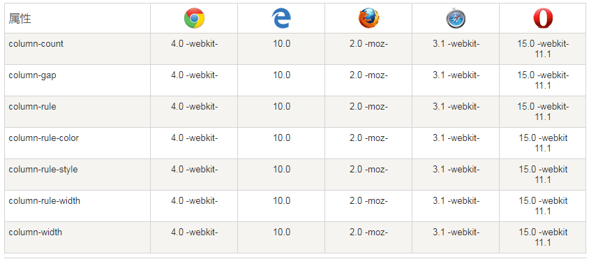

