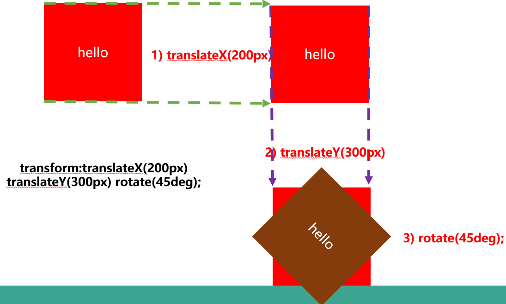
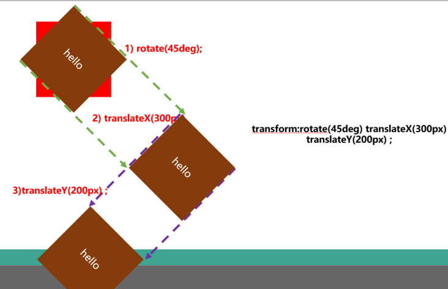
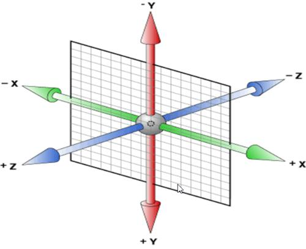

# day15

css3动画： 过渡    变形    关键帧动画

## 过渡：

一般来说  ，通过事件触发 :hover  :active

```css
transition:要过渡的属性名字  持续时间1s   延时时间0s  运动曲线 (ease,linear)   ;

transition:width 1s;

transition:width 1s , height 2s,opcity 0.5s;

transition:all 1s;  all  
```


## 2d变形：

平移   缩放  旋转  倾斜

#### 平移: 

```css
transform:translate(x,y) 水平x 垂直y  +x +y -x -y
transform:translate(300px,500px);
transform:translate(50%,-50%) 自身宽高宽高的一半
```

应用：实现居中(不要求知道盒子的宽高)

```css
div {
    position:absolute;
    left:50%;
    top:50%;
    transform:translate(-50%,-50%);
}
```

#### 缩放：

```css
transform:scale(w,h); w,h=0  w<1 缩小 w>1 放大
transform:scale(1.2);等比例放大
```

应用： 显示小于12px字体

默认字体:font-size:12px  显示10px字体   行内块+块类型的盒子 +transform:scale(10/12);


#### 旋转

```css
transform:rotate(ndeg);+ndeg 顺时针旋转 -ndeg 逆时针旋转
```


#### 倾斜

```css
transform:skew(xdeg,ydeg); xdeg在x轴有倾斜倾斜度数为xdeg  y在y轴有倾斜

-xdeg 在x正方向的倾斜
+xdeg 在X负方向的倾斜

transform:skew(xdeg) 只有x轴倾斜
```


#### 修改变形中心的属性

```css
2d,3d修改变形中心
           transform-origin:center center(默认值，中心)
           xpx ypx/ x% y% /right top bottom left center
           transform-origin:100% 0%; 修改变形中心到盒子的右上角
```

#### 变形属性的复合写法

>变化样式可以使用复合写法，如 
>transform: scale(  )    translate（ ）   skew(   )   rotate(    );
>
>
>
>变化样式内多个样式值顺序的不同会导致完全不一样的结果
>
>transform:translateX(300px)    translateY(200px)    rotate(45deg);
>
>和
>
>transform:rotate(45deg)    translateX(300px)    translateY(200px) ;
>
>效果是不一样的







## 3d变形

3d坐标系 --》左手定则  食指(y) 中指(z)  大拇指 (x)



#### 3d平移

```css
transform:translate3d(x,y,z);z 代表沿着z平移 +z 正方向移动 -z 负方向移动

transform:translateX(300px);
transform:translateY(300px);
transform:translateZ(300px);

transform:translate3d(300px,300px,300px);
transform:translateX(300px) translateY(300px) translateZ(300px);(时间顺序)
```

#### 景深属性(视距)

不为0视距---》形成一个3d效果 ，3d空间---》近大远小

```css
perspective:800px;( 600px--1000px) 800px 就代表你的眼睛到3d变形物体有800px的距离
```

**一般，设置到变形元素的父盒子身上即可  是在事件触发时才会使用景深去营造3d效果**


#### 3d旋转

```css
transform:rotate3d(x,y,z,ndeg);
x:1/0 1:沿着X轴有旋转  0沿着x轴没有旋转
y:1/0 1:沿着y轴有旋转  0沿着y轴没有旋转
z:1/0 1:沿着z轴有旋转  0沿着z轴没有旋转

ndeg 代表旋转度数


```

##### 绕X轴旋转: 

```css
transform:rotate3d(1,0,0,45deg); 绕着x轴旋转了45deg
等同于transform:rotateX(45deg);
```

**绕Y轴旋转:**

```css
transform:rotate3d(0,1,0,45deg); 绕着y轴旋转了45deg
等同于transform:rotateY(45deg);
```

**绕Z轴旋转**

```css
transform:rotate3d(0,0,1,45deg); 绕着z轴旋转了45deg
等同于transform:rotateZ(45deg);
```

**绕面旋转**

```css
transform:rotate3d(1,1,0,45deg); 绕着x轴和y轴组成的平面对角线旋转了45deg

```

**绕体旋转**

```css
transform:rotate3d(1,1,1,45deg); 绕着x轴和y轴和z轴组成的体对角线旋转了45deg
```


### 背面隐藏属性

```css
 backface-visibility: hidden隐藏/visible可见的(默认的);
```

### 保留3d状态(用在没有事件触发时候显示3d效果)

```css
transform-style:preserve-3d保留3d效果/flat回到2d状态（回到最初状态 默认值）
```

==一般这个属性写在父盒子身上==


## 关键帧动画（补间动画）

小车折返： 初始状态 (100px,100px) ----> 树跟前装上去(400px,400px)---->旋转掉头(300px,300px)---->最初位置

动画： 多个状态的持续！！！

### 先定义

```css
@keyframes 动画的名称 {
    //几个关键状态  
    0% {
        //最初状态 
        css代码;
    }
    .....
    n%{
        
    }
   
    100% {
        //最终的状态
    }
    
}
```


### 后使用

```css
animation:动画的名称  持续的时间  【运动的曲线  延时的时间  执行的次数  是否往返  运动的状态  动画最后一帧的状态】;  


动画的名称 animation-name:动画的名称;
持续的时间 animation-duration:ns;
运动的曲线 animation-timing-function:linear/ease/ease-in/ease-in-out..
延时的时间 animation-delay: ns;
执行的次数  animation-iteration-count:1默认/2/3/infinite;
是否往返 animation-direction:normal不往返/alternate往返
运动的状态 animation-play-state:running播放/paused停止

动画最后一帧的状态animation-fill-mode: forwards动画保持最后一帧的状态/backwards动画回到第一帧的状态

```


## css3动画库 animate.css

网址: https://animate.style/

引入动画库:

```css
<head>
  <link
    rel="stylesheet"
    href="https://cdnjs.cloudflare.com/ajax/libs/animate.css/4.1.1/animate.min.css"
  />
</head>
```


使用动画

```css
<h1 class="animate__animated animate__bounce">An animated element</h1>
```

